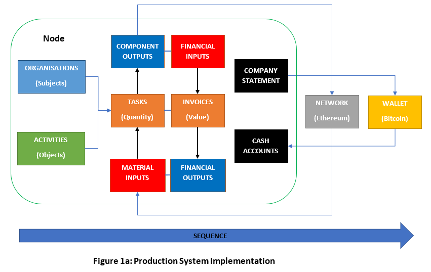
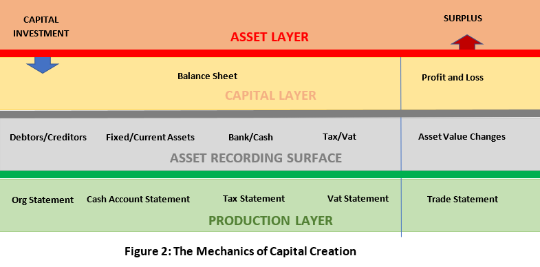
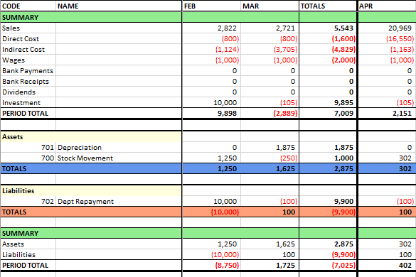
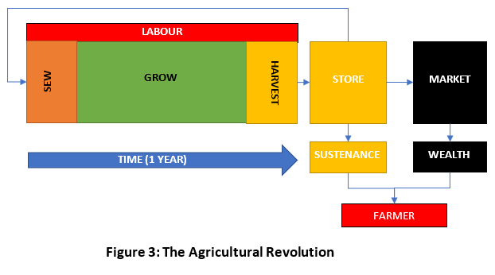
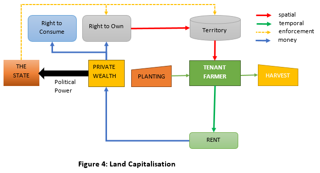
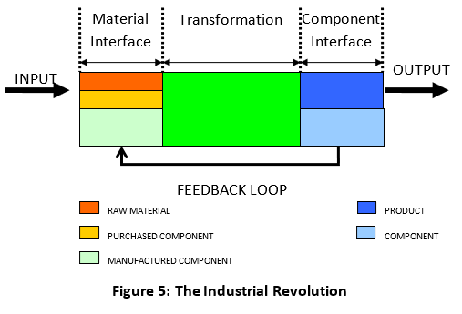
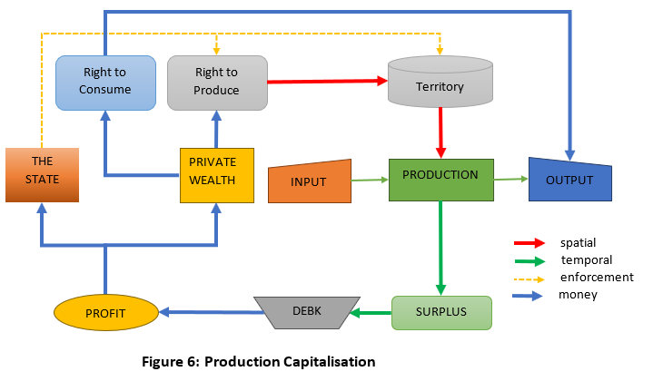
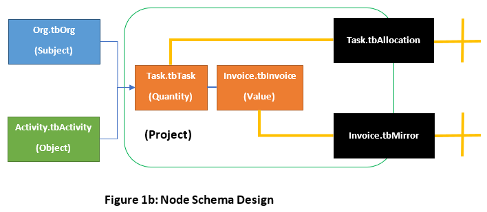
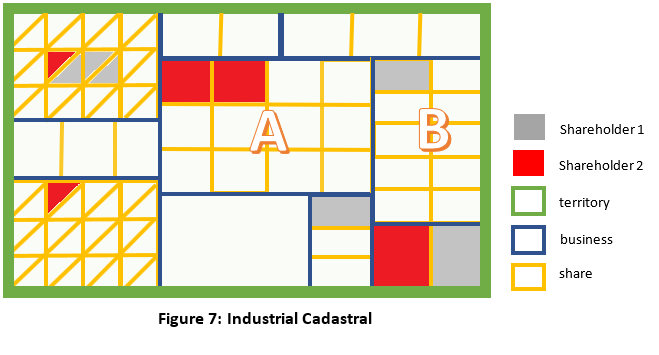
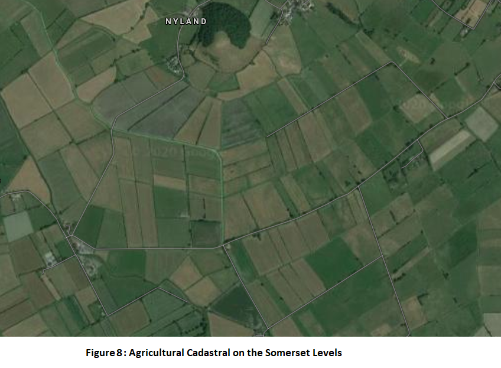

# Trade Control - Assets

Published on 31 December 2020.

Previously, [I concluded](tc_balance_sheet.md#conclusion) that a production system works independently from the calculation of assets; and that the mentality behind asset production is ancient. Here I explore those conclusions. 

## Requirements

- [Production Theory](tc_functions.md)
- [A Trade Control node](https://tradecontrol.github.io/tutorials/installing-sqlnode)
- [BoM tutorial](https://tradecontrol.github.io/tutorials/manufacturing)
- [Balance Sheets](tc_balance_sheet.md)
- [Profit and Loss](tc_profit_and_loss.md)

## System Implementation

Were you to have followed the development path of the app on Trade Control's [GitHub site](https://github.com/tradecontrol), the sequence of the unfolding will have communicated an important fact about the commercial world. **Figure 1a** illustrates the implementation of the theory in sequence up to [version 3.28.5](changelogs.md#sql-node).

> GitHub allows you to retrospectively trace that history by cloning the projects in Visual Studio or GitHub Desktop.

Looking closely at this diagram, you can see how version **3.28.5** has both fully implemented the production theory and provides all the elements required for trade. You can model the production of material interfaces into components to any level of abstraction and complexity. By connecting nodes together into supply-chains, you may then orchestrate their production, distribution and sale from material to finished product.

The relations in this arrangement are highly involved and the interconnectivity levels dynamic and perpetually evolving, like the ecosystems of earth. There will come a time when this model of trade is all you need, but today, that is not the case. Business news is dominated by a conceptual meta-layer projected from outside the production process. The machinations of the meta-layer are the corporate world of financial traders, asset managers, bankers, businessmen and their global corporations. Their mentality mutates productive resources into tradable assets that store or generate value. However, in truth it is the productive resource that has the value, not the asset. Therefore, they must find a way to interface into its transformational processes to extract asset value. This is the job of accountants who record transactions as assets in double-entry ledgers. In so doing, their accounting systems derive capital by concealing the production system upon which it depends. If the asset contained the value, what would be the point of them?

Version **3.28.5** demonstrates that trade functions perfectly well without the asset meta-layer, but it does not fit in with our current commercial framework. To comply with this model of commerce, I had to make a functional connection to the production system that presents an asset UI in the form of capital. Version **3.30.3** has that capability. How I did that is explained in the section on [balance sheets](tc_balance_sheet.md). Rather than conceal the production system like an accountant, my method has been designed to reveal it.

## Capital Creation

During the 80's, financial markets began maximising private wealth through derived financial instruments and debt. Although the opportunity to do so was presented by capitalism, it is a deviation from its core industrial purpose. Before then, since the Industrial Revolution (IR), capitalism played a vital role in stimulating investment in the important innovations that have affected human development.  Stock Markets maximised public wealth by creating more capital for industry. That was due to the mechanics of capital creation from productive resources. Since modern financial markets are derived, these functional mechanisms cannot be escaped and remain in place today.   

The mechanics are best understood by visualising the transition from production to capital asset in terms of layers. **Figure 2** presents these layers as I have modelled them in the Trade Control node. They are not my interpretation or opinion; it is how the world works. The layers are embodied in the code because otherwise it could not function, either to [model workflows](tc_functions.md#workflow) or calculate capital and present accounts.   

### Production Layer

The Production Layer is illustrated in **Figure 1a** and is covered [by the paper on production](tc_functions.md). The data sources for the Asset Recording Layer are described in the [construction section](tc_balance_sheet.md#construction) of the balance sheet documentation. The [Trade Statement](https://github.com/TradeControl/office/blob/master/src/excel/xltCashFlow/Biz/DataLoader.cs) is the P&L without asset recording or the task-based accruals that controllers can optionally use for scheduling workflow financing. It is important to understand that the Production Layer is not connected to the Asset Recording Surface and can therefore work independently. Without the Production Layer, you will die. The other layers are grafted onto production in order to define ownership and distribute value.

The corresponding code that reflects the value-chain inside the Production Layer is as follows:

| Statement | T-Sql |
| -- | -- |
| Organisation | [Org.vwStatement](https://github.com/tradecontrol/sqlnode/blob/master/src/tcNodeDb/Org/Views/vwStatement.sql) |
| Cash Account | [Cash.vwAccountStatement](https://github.com/tradecontrol/sqlnode/blob/master/src/tcNodeDb/Cash/Views/vwAccountStatement.sql) |
| Corporation Tax | [Cash.vwTaxCorpStatement](https://github.com/tradecontrol/sqlnode/blob/master/src/tcNodeDb/Cash/Views/vwTaxCorpStatement.sql) |
| VAT | [Cash.vwTaxVatStatement](https://github.com/tradecontrol/sqlnode/blob/master/src/tcNodeDb/Cash/Views/vwTaxVatStatement.sql) |
| Trade Profits | [Cash.fnFlowCategory(CashType.Trade)](https://github.com/tradecontrol/sqlnode/blob/master/src/tcNodeDb/Cash/Functions/fnFlowCategory.sql) |

### Recording Surface

There are no assets inside a production system; there are only inputs, outputs and transformations. Therefore the Asset Recording Surface is derived from the Production Layer by applying an [asset charge](tc_balance_sheet.md#asset-charge) algorithm to the statements. Accounting systems do not have a Production Layer because their recording surface is constructed from the ledgers of [DEBK](tc_profit_and_loss.md#double-entry-book-keeping). Each transaction is double entered to pre-record asset charge, enabling them to directly derive the balance sheet and P&L from their accounts. In this way, the recording surface conceals the Production Layer upon which it depends.  

To create a recording surface that serves the Asset Layer, we either apply asset charge directly, or extract the information required to do so:

| Statement | T-Sql |
| -- | -- |
| Creditors and Debtors | [Cash.vwBalanceSheetOrgs](https://github.com/tradecontrol/sqlnode/blob/master/src/tcNodeDb/Cash/Views/vwBalanceSheetOrgs.sql) |
| Bank and Cash | [Cash.vwBalanceSheetAccounts](https://github.com/tradecontrol/sqlnode/blob/master/src/tcNodeDb/Cash/Views/vwBalanceSheetAccounts.sql) |
| Assets and Liabilities | [Cash.vwBalanceSheetAssets](https://github.com/tradecontrol/sqlnode/blob/master/src/tcNodeDb/Cash/Views/vwBalanceSheetAssets.sql) |
| Corporation Tax | [Cash.vwBalanceSheetTax](https://github.com/tradecontrol/sqlnode/blob/master/src/tcNodeDb/Cash/Views/vwBalanceSheetTax.sql) |
| VAT | [Cash.vwBalanceSheetVat](https://github.com/tradecontrol/sqlnode/blob/master/src/tcNodeDb/Cash/Views/vwBalanceSheetVat.sql) |
| Asset Profits | [Cash.fnFlowCategory(CashType.Money)](https://github.com/tradecontrol/sqlnode/blob/master/src/tcNodeDb/Cash/Functions/fnFlowCategory.sql) |

### Capital Layer

The asset recording surface provides an abstract interface from which capital can be extracted. The mechanics of the capital calculation already covered in the article on [Balance Sheets](tc_balance_sheet.md). The Profit and Loss Account (P&L) in the Capital Layer must include movement in assets as well as the income and expenditure of trade. Looking at the Trade Statement of Trade Control, there are now two sections. The first is in the Production Layer and has therefore been present since the beginning. I added the second with the introduction of the Balance Sheet. Now, the profit is calculated as the difference between two capital values during a given accounting period. So, deducting last year’s capital from current year-end should equal the profit on the corresponding P&L. Here are the two sections on the Trade Statement, showing production then assets:

### Asset Layer

Capital services the Asset Layer, which embodies a different mentality and ruleset to that required by production. The Asset Layer, therefore, marks the threshold over which the Trade Control model cannot pass. This layer is demarked by the [business entity](tc_profit_and_loss.md#business-entity) defined by Company Law. A functional description of production does not need to include the Asset Layer. This is demonstrated in version **3.28.5** (**Figure 1a**), which can orchestrate the productive and commercial process without it. 

A functional explanation of technological production applies equally to the manufacture of particle accelerators and atomic bombs. Manufacture whatever you like, the process is the same. However, whilst these projects are carried out by the same people, clearly their nature is very different. How that difference can be defined is related to the Asset Layer by virtue of their shared mentality. 

Interaction with the Asset Layer is generally sealed off to most by their employment contracts; whilst much of the services sector swim in its sea and are unaware of the source. Yet anyone can feel the visceral power of the Asset Layer by simply not paying their rent or mortgage; but it needs to be clearly defined. The article on [Profit and Loss](tc_profit_and_loss.md#debt) provides the following definition:

> An asset can be regarded as the territorialised root node of a [Spatial Workflow](tc_functions.md#object-structure) that expresses [a UI](tc_functions.md#interfaces)

To unpack the definition, I explore the Asset Layer in four stages:

1. Asset Layer development can be traced in two giant leaps - the Agricultural and Industrial Revolutions.
2. Assets are an exploitation of biological abstraction. This is obvious when human interface projection is applied to natural systems.
3. Assets are evaluated in money and money is defined as an asset. To overcome this circularity, I redefine money in terms that are compatible with the Production Layer.
4. The Trade Control node must legally service the Asset Layer. I show what that looks like.

## Revolution

When considering the two most important revolutions in human history, there is a tendency to think that agriculture caused the Agricultural Revolution (AR) and industry caused the Industrial Revolution (IR). That interpretation is not very helpful for our purposes. Firstly, it leads to the belief that the IR continued into the nineteenth century, which was in fact a period of industrialisation, not revolution. Secondly it lends credence to the idea that, rather than being a one-off event, the IR can be re-run, over and over. Apparently, we are now in IR 4.0. since industry has revolutionised itself four times, each iteration producing yet more industry. In truth, these are only significant developments that follow on from the singular revolution in eighteenth century Britain. Both conceptions result from the belief that industry caused the revolution. Like the AR before it, the revolution caused the industry.

### Agriculture

The mentality behind the definition of a [Business Entity](tc_profit_and_loss.md#business-entity) in Company Law is identical to that behind land ownership. The connection between capitalism and agriculture has been known since the Industrial Revolution (IR). David Ricardo, who was born during the revolution, pointed out in his book *Principles of Political Economy and Taxation*, published in 1817, that the structure of the industrial factory was drawn from techniques learnt by wealthy landowners capitalising their land. Throughout the 18th century, hundreds of hated Enclosure Acts issued by Parliament transferred communal land into the possession of these wealthy landowners; land that will never be returned. According to Ricardo, the resulting three agrarian classes of owner, renter/farmer and labourer were the foundation for the industrial equivalents of Shareholder, Management/Machinery and Worker. Therefore, to see where this Asset Layer is coming from, we need to look back to the Agricultural Revolution that preceded it.

The first ever farmer projects an abstract plane onto the open field, initialising the Agricultural Revolution (AR). His projected interface destroys its native ecological state by ploughing the soil and planting his crop. He tends to his territory, protects it and watches it grow. Then at seasons end, a fine harvest and festivities; crop failure and starvation; or something in between. So, this farmer wants to know one thing: how much has he harvested (P&L)? The agrarian process is depicted in **Figure 3**.

Ricardo understood that the Enclosure Acts changed this ten-thousand-year-old bucolic situation. Looking at **Figure 3**, if you were a farmer trying to purchase the land, you might think that its value is in the wealth it is able to generate. The value will be determined by productive output (supply) and how much the market is prepared to pay for the produce (demand). However, calculating land value does not mean much if it is commonly owned. Enclosure was not imposed by farmers trying to privately own the land they tilled, but merchants and aristocrats. Their corrupt MPs and lawyers created legislation for the state backed theft of the Commons from the British people and pushed it through Parliament. But instead of turning the peasants into serfs, they created artificial scarcity. Land, not crops, became the tradable commodity, the source of wealth, and the land was rented out.

By the end of the IR, three quarters of all farmers were tenants. Tenant farmers organised food production in accordance with **Figure 4**, which was the same as before, only now they had to pay rent to their landlord who was nowhere to be seen. Increases in rent could only be paid for by increases in productive output.  

Once all the land had been stolen by the Enclosure Acts and become a tradable commodity, the landowner would want to know two things:

1. how much rent has he collected? 
2. how much more land has he got? 

These questions could be answered by a proto P&L and Balance Sheet. Therefore, wealthy landowners not only provided the framework for the capitalisation of industry, but also much of the initial capital levied from the rents of their unfortunate tenants. It is not the only reason why the IR occurred in Britain and nowhere else, but it conditioned how it played out.

The increase in agricultural output during the Enclosures is commonly regarded as a second AR.  However, improving productive output is more a development. The second AR is better understood as the IR emerging. You can see this in **Figure 4**. It just lacks the feedback loops of the Industrial Revolution.

### Industry

The Industrial Revolution is responsible for the technological landscape we have today. It took place in Britain during the second half of the eighteenth century. The causes were complex and still interestingly debated, at least in Britain.  Putting historical contingencies aside, we can nevertheless understand the fundamental nature of the revolution. 

The functional foundation for industrial production is expressed in **Figure 5**, which presents a factory to match the [component definition](tc_functions.md#component-definition). Like **Figure 3** there are inputs, transformations and outputs. However, the big difference between factory and farm is that productive units in the IR connect to Workflows. Each feedback loop is the consequence of component production, delivering new products and increased productivity.

The capitalisation of production exploits every productive process by treating it as a plot of land. This is not straight forward, because land is 2D, whilst production is multi-dimensional. To overcome the problem, capitalism territorialises, not just the space of the AR, but also [productive time](tc_profit_and_loss.md#capital-extraction). The Revolution, however, was not the territorialisation of time, because that is only a continuation of land ownership. It was the discovery, that life had already discovered many millions of years before, of [interface projection itself](tc_functions.md#components) and how it worked. 

This knowledge enabled British engineers to harness energy with machines and extend human reach through technological innovation and mass production, resulting in the first industrialisation of society. In proliferating the networks of production and consumption, they created new planes of abstraction that could be appropriated by the territorial force fields of the dominant powers. The methods required to achieve that appropriation elevate its sophistication beyond land capitalisation: because it must at first form hierarchies of territorialisation that map onto the [Spatial Workflow](tc_functions.md#object-structure). Then its force field can reap the surpluses of production by territorialising the [Temporal Workflows](tc_functions.md#production-process) that must pass through it. The capitalisation of production, therefore, is the art of translating productive flows into assets. 

The arrangement is derived from the more primitive capitalisation of land. You can see the addition of the IR feedback loop in **Figure 6**. Also, note how private wealth's direct access to political power has been removed. Whilst the IR opened the door to limitless technological creativity, private wealth created its own legal system and courts to exploit it. 

The impact of this appropriation is as severe as it is transformative. Not only are the projected interfaces distorted and simplified by the finite conditions of territorialisation; it maxes out production levels in the consuming demand for surplus; and it collectively escalates the degree to which the exploitation of resources can be applied globally. Most importantly, the IR handed unlimited transformational power to the dominant occupants of the State from the Agricultural Revolution that preceded it. This is beautifully described by Andro Linklater in his great book[^1]. 

## Abstraction

### Node Schema

According to my production theory, it is not possible to model productive processes in a universe that consist of only objects and subjects. I point out that there were two kinds of processes going on - the production of component interfaces and their consumption through a user interface. The latter connects to the value-stream. For example, a half-finished car has no viable UI and therefore is without value to the user. However, the business entity itself is an asset, and therefore its components are evaluated as stock and their value transferred onto the balance sheet. But how is that value assessed? The material value of any component is known from the UOQ and the unit purchase price. But cost also includes the amount of work invested in its transformation. The techniques of Cost Accounting evaluate the cost of a given slice of time by spatialising the temporal workflow. Thus, asset value can be assigned to units of productive time, turning projects into objects. The Business Entity is a concept of the Asset Layer dependent upon the function of production. To become an asset, the Business Entity must remove these productive processes and cast itself as a set of subjects (debtors, creditors...) and objects (fixed assets, stock...). 

**Figure 1b** is the underlying schema design of the production system implementation in **Figure 1a**.  

| Schema | T-Sql |
| -- | -- |
| Subjects | [Org.tbOrg](https://github.com/tradecontrol/sqlnode/blob/master/src/tcNodeDb/Org/Tables/tbOrg.sql) |
| Objects | [Activity.tbActivity](https://github.com/tradecontrol/sqlnode/blob/master/src/tcNodeDb/Activity/Tables/tbActivity.sql) |
| Quantity | [Task.tbTask](https://github.com/tradecontrol/sqlnode/blob/master/src/tcNodeDb/Task/Tables/tbTask.sql) |
| Value | [Invoice.tbInvoice](https://github.com/tradecontrol/sqlnode/blob/master/src/tcNodeDb/Invoice/Tables/tbInvoice.sql) |
| Physical Connector | [Task.tbAllocation](https://github.com/tradecontrol/sqlnode/blob/master/src/tcNodeDb/Task/Tables/tbAllocation.sql) |
| Financial Connector | [Invoice.tbMirror](https://github.com/tradecontrol/sqlnode/blob/master/src/tcNodeDb/Invoice/Tables/tbMirror.sql) |

If we remove Projects from the schema, you are left with subjects and objects, like the mind/body, consciousness/matter dualism. In so doing, the code will still be able to model assets, but not production. With this cut-down schema you could model spatial workflows from objects, as presented in the [Bill of Materials tutorial](https://tradecontrol.github.io/tutorials/manufacturing#bom-specification). You also have subjects that can project a User Interface, so the Business Entity preserves its debtor/creditor relations. In other words, the schema can still implement [my definition of an asset](#asset-layer). A DEBK recording surface may then attach to this schema and derive the Company Accounts. Unfortunately, the schema is no longer a node because it [lacks the connectors](https://tradcontrol.github.io/tutorials/network) needed to form supply-chains. Worse still, how is it going to produce stuff without re-inventing the Projects schema (whether implicitly in practice or explicitly in code)? So where are your assets going to come from in the first place? The only assets this schema design can incorporate are already provided by the earth, which economists call Natural Capital. Without functional interface projection, the Industrial Revolution could not have happened. Which begs the question, if a factory cannot produce a single component of any kind under this dualistic model, how is it an appropriate framework for [describing biological evolution](tc_functions.md#life) and embryonic development?

When we re-apply the schema derived from my description of the [technological object](tc_functions.md#subjects-and-objects), we can start producing again and forming supply-chains. But we can also apply interface projection to the asset-based world view in a very simple yet informative way. 

### Unitary Interface Projection

The AR was possible because humans can apply an abstract plane onto productive potential in an act of territorialisation. Animals do that as well in establishing territory, but only in relation to their own species. These human abstract planes act as a force field such that all the processes inside its territory conform to the will of the subject that projects it. I will therefore call this functional power a *Unitary Interface Projection* (UIP). 

UIP precedes territorialisation. For example, two warring parties each emit a UIP on a disputed territory. Violence ensues. Only the victor can territorialise the land. It is subsequently broken up into smaller plots and the process repeats forming social and political hierarchies of UIP abstraction (such as rented private property).

### Darwin's Square

The easiest way to understand UIP and its relation to violence is Darwin's Square (DS). 

One day, Darwin set aside a small plot in his garden for nature to do its own thing.  He could then objectively monitor exactly what was going on. From his observations, he discovered that the closer he looked and the longer he left it, the more he saw. He was restricted to the ecologies of multi-cellular life, which in themselves were spectacular. If he had access to modern instruments, this process could have gone on to cellular levels, and further through their membranes into the inner structure of their microscopic world (the biological equivalent of technological Spatial Workflows that service Consumer Networks). He may even have revealed the collaboration of fungi and plant in ecological formations (like Temporal Workflows serviced by Production Networks).

Ecosystems form when a multiplicity of functional projections each connect the interfaces of their abstract plane, creating complex pathways of production and consumption in diverse dimensions of abstraction (from cell to organ, from tree to forest). Competition takes place within each species to find the best way they can fit in. Thus, as Darwin described, dynamic feedback loops encourage the earth's creatures to evolve.  

What would happen to Darwin's Square if a single species were able to project its abstract plane onto the entire space? In short, if there are no longer interfaces where other species can fit in, evolution, as described by Darwin, must cease. 

> "Hey Charlie, this plot of yours is just taking up space! Let's pave it over and fire up the barb. It will be so cool!"

This simple statement of intent constitutes the Territorialisation of Space - the revolution behind the birth of human agriculture and the correlative Dominion of Kings. A state of UIP is a territorial force field conditioning the kinds of processes that can and cannot take place within its domain. The infinitude of the ecological state is replaced with a simplified abstract plane that provides finite interfaces to unitary projection, like the patio in our example. A patio is the product of a supply-chain; therefore, it has a single User Interface, like the smooth surface of a desk. No matter how complicated the resource is, or how abstract, always a more abstract plane can be applied. From allotment to estate, house to city, country to empire, this fact always applies. It is therefore a weapon of terrible power; and tragically, an abuse of the very abstraction that life created in order to evolve.

> In this light, it is self-evident that the concept of [Natural Capital](https://en.wikipedia.org/wiki/Natural_capital) is an oxymoron. Capital only has meaning inside a unitary interface, as a measure of an asset's liability to the projecting subject. Nature, as described by Darwin, is the exact opposite of that.

> It is also worth noting that emitting a UIP is not a question of intellect, but mentality. An atomic bomb is a sophisticated amalgam of science, technology and politics, yet incarnates the terror of unconstrained UIP, like a giant slab slamming onto a city.

## Money

The Asset Layer is projected from a mentality that objectifies both production and money, in the form of territory (like farmland or the Royal Court) and store of value (like a barn of grain or vault of gold). Production outputs product that has value and value is exchanged and stored in money. Owning productive resources means the money it makes can be transferred into your own store. How rich you are is determined by how much money is in your store and the net worth of the money-producing assets it has bought you. This mentality has determined the system we have for distributing value. Different systems would evolve if the mentality were to change. And there is a way of understanding money without objectifying it.

The Allocation of Rights is normally associated with a legislative framework issued by a sovereign state or governing body. But money performs the same task within a commercial setting. If we conceive of money as an Allocation of Rights instead of a Store of Value, how much money you have determines your rights to natural and human resources. A Store of Value, therefore, is a UIP that allocates rights to the fruits of the Production Layer. This makes sense because a legal framework is integral to how money works.

Under the present system, money can buy you the right to emit a territorial force field around any productive resource by purchasing ownership. The State provides the coercive legislative framework to guarantee that right remains in force. You then have the further right to legislate access to its interfaces in contracts; to safeguard your territory and effectively monetise it (such as T&C, Leases, Tenancy, IP and Royalty Agreements). These laws are enforced in Commercial Courts. In this way, the coercive might of the State is assigned to the Owner. Those who encourage the rollback of the State will always want to retain the State's capacity to enforce their own laws, otherwise the contracts upon which their wealth and power depends are just paper. 

Therefore, there are two kinds of right that can be purchased here, illustrated in **Figure 6**:

- The right to produce, issued by the State across the [Production Network](tc_functions.md#production-networks) (Company Law)
- The right to consume, issued by the Owner across the [Consumer Network](tc_functions.md#consumer-networks) (Contract Law)

These rights bestowed by the Asset Layer are obtained in exchange for money objectified as a Store of Value. How much rights any subject has is measured by their share of the store and their capacity to emit unitary force fields over productive resources. This arrangement becomes problematic when money can be brought into existence through the issuance of debt rather than value generated by rights to produce. Money that has a fixed supply, called hard currency, prevents the Asset Layer from exploiting this disconnection.

When money is conceived as an Allocation of Rights, the currency must be hard so that rights cannot be simply materialised by fiat. When dominant powers increase the money supply, through pure UIP in the form of credit/debt, they are bestowing rights to resources without reference to its production, which is a kind of theft. With hard money that is not possible. Money supply increases in accordance with market demand; for, whilst the overall pool of rights is finite, the allocation can be infinitely divisible. In practice, for example, the divisibility of bitcoin is the satoshi, which currently stands at GBP 0.00014, or 0.014 pence (although it can be yet further sub-divided on a sidechain). 

Connecting a hard currency to the Production Layer is the first reason why I have coded a [commercial bitcoin wallet](https://tradecontrol.github.io/bitcoin).

## Asset Implementation

Returning to **Figure 2**, it is the codes practical derivation of the Asset Recording Surface and Capital Accounts from the production system that reveal the Asset Layer - a system of ownership for servicing UIP, separated from the productive workflows from which its value is derived. A financial 'trade' is not really an exchange. There is no associated production of value in the transaction and therefore no shift in [cash/quantity polarity](tc_functions.md#supply-and-demand). A financial trade is payment for a re-allocation of rights. Finance interprets that re-allocation as a trade through UIP in the form of assets, digital or real. Because the trade is disassociated from the earthly constraints of production, it can operate at lightning speeds, as though orchestrated by angels liberated from the constraints of [space and time](tc_functions.md#production-process).  

This fact is demonstrated in the practice of High Frequency Trading, where HFT platforms guarantee that the time from order to acknowledgement is under 10 milliseconds (and less). Without the space and time to produce value which precedes a genuine trade, a HF transaction only needs to apply the cost of moving the allocation of rights to an asset from one party to another.

The Asset Layer is a vast enterprise, for once a UIP is applied to the output of a productive workflow, owners can maximise exploitation by abstracting its interfaces, thereby deriving new meta-layers of connectivity (such as financial instruments and products). These extensions are non-foundational, and therefore I will only example [a simple case](#cadastral).

**Figure 7** depicts the Asset Layer as it is presented to financial investors in the form of a cadastral: 

> The *cadastral* is an official map of assets recording size, value and ownership.

Each business is like a plot of publicly or privately owned land divided into shares of equal value. Beneath the business is the concealed Production Layer feeding surplus value to the UIP. The collective territory is a surface that expands and contracts in relation to the economic performance of the Production Layer. It is equivalent to the patio on [Darwin's Square](#darwins-square), but linked to the temporal workflows of IR production.  Business **A** may very well be in a supply-chain with **B**, and that is obviously visible inside the workflows of the Production Layer, but there is nothing in the cadastral that connects them. For public stocks, shareholders **1** and **2** can buy whatever shares they want on the 2d map, provided they are willing to pay the latest price on the exchange.

### Financial Trading

There are two ways to extract money directly from the share:

1. Dividend payments off the balance sheet, the value of which is reflected in the share price
2. Buying the share at a low price and selling it high

Business **A** decides it needs to raise capital, so it issues an additional 12 shares. That means the number of squares in **A** goes up accordingly (6x4). Shareholder **2** might decide to increase investment in **A**'s stock, as their Balance Sheet at Companies House is continuously growing. The shareholder buys the shares from Business **A**, injecting capital into the company. Shareholder **2** either holds the stock to accept dividend payments or sells the share later to cash in on the escalating share price. Let us say Shareholder **1** buys the shares. The transaction makes no difference to the Production Layer, since rights are simply re-allocated to a different party who will receive the dividends instead. In **Figure 7**, a red square turns grey. Only shares bought from a business issuing capital will inject money into the Production Layer. The vast majority of financial transactions purchase share price rather than inject capital, which just shift rights allocations around the cadastral. That is why buying stocks and shares does not necessarily contribute to capital investment. Rather than capital creation, player rights are just being re-allocated.

Sometimes businesses can even decide to destroy capital by repurchasing their own shares, which is capitalism in reverse. By such means, they can increase the share price and dividend payments of remaining holders or facilitate insider trading. Either way, it disinvests the Production Layer. 

### Cadastral

The cadastral of the LSE and NYSE are plugged directly into the Production Layer by the Balance Sheet. The shares on the exchange must be atomic (you cannot own 0.3% of a share listed by Companies House).  However, because [further abstraction](#darwins-square) is always possible, we could derive a new cadastral that can benefit from Production Layer disconnection, to allow partial share ownership, competitively lowering the bar for market entry. To code this idea into a financial trading platform, we replace Company Law (issued by the State) with Commercial Law (issued by the Company) by virtue of our right to produce (since we own the company). The trader is bestowed the right to consume tokens representing micro-shares without fees by agreeing to comply with these laws. The trader only appears to own shares in company capital and to be investing in capital markets. What they have is a right to a token that represents a share of a share as defined by the contractual rules laid down by the company. Our new cadastral becomes the perfect middleman - hiding costs from the customers and aggregating their income to acquire purchasing power.

A similar cadastral to the stock market is also imposed upon hard money by the Asset Layer; except the territorial border is fixed, each plot occupies the same area (in units of 1 satoshi), there are no servicing workflows and hence no surpluses to extract. But it looks the same. 

Variants of the cadastral are everywhere because it is ancient and engrained. **Figure 7** is like an aerial view of the farmlands on the Nile Delta at the dawn of civilisation, marked out with the boundary stones laid down by knot-tying rope-stretchers. Each year, after the life-bearing floodwaters recede from the delta, the rope-stretchers would redraw their map upon the plain. Those servants of Pharaoh would have recognised the Somerset Levels of today, presented in **Figure 8**, because Satellite View is also a map. This cadastral is imposed upon the Level's ecosystems by the UIP of the meat and dairy industry.

Companies House is thus the modern equivalent of the cadastral of antiquity. The shareholders of today [must pay taxes](tc_profit_and_loss.md#capital-extraction) to the State from their surpluses, just as those ancient tillers of land were obliged to pay theirs in tribute to the Royal Court. Whether modern state or royal court, the rulers proliferate a system to record and monitor the assets within their jurisdiction, to ensure compliance and impose a legal framework for punishing transgression. The cornerstone for the formation of these laws and their execution is, and has always been, the projection of unitary interfaces.

## Conclusion

The cadastral reveals how capitalism is the application of an Agricultural Revolution mentality to the Industrial Revolution. It enabled the dynasties of the rich and powerful to perpetuate and maintain themselves throughout the transition. But it is also the reason why I must graft on the [asset extraction code](#recording-surface) if I want to obtain legal compliance - answering the question I posed previously in my article on [Profit and Loss](tc_profit_and_loss.md#conclusion).

As the earth burns up like paper in fire, humanity desperately needs the rights to natural and human resources in the hands of scientists, engineers and innovators. But under the yoke of UIP, how can that be realistically achieved? Currently, all the rights are being systematically transferred into the hands of those few furthest removed from production - Moneymen, the State and the Kings of Commerce. 

In that light, here is something to think about:

Now the rights are largely appropriated, Asset Man can transcribe his cadastral into a mathematically enforced hard currency and those rights will be set forever in digital gold. For gold is the first and last refuge of The Fallen ([DS -> UIP](#darwins-square))

## Licence

 

Licenced by Ian Monnox under a [Creative Commons Attribution-NoDerivatives 4.0 International License](http://creativecommons.org/licenses/by-nd/4.0/) 

## References

[^1]: Owning the Earth. Andro Linklater 2014. 

