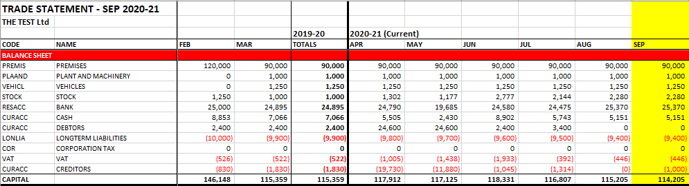
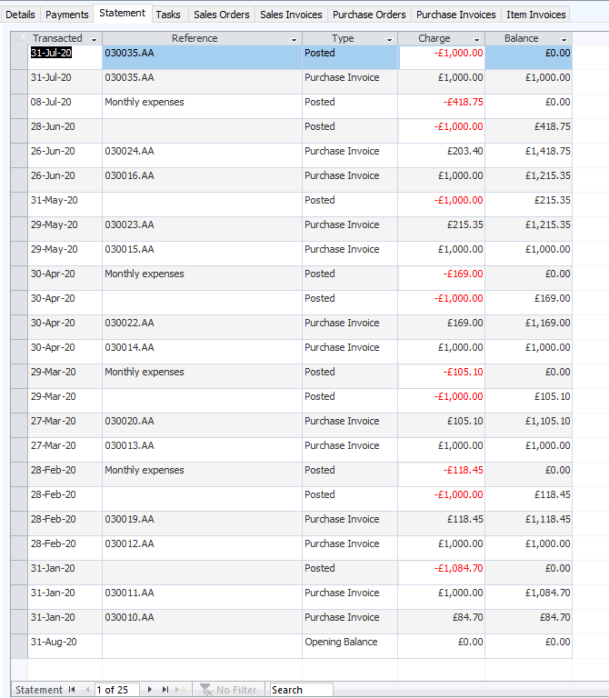
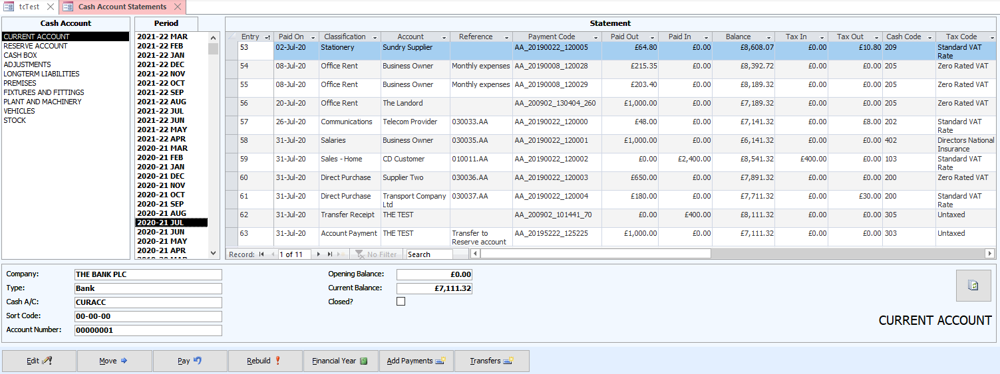

# Balance Sheets

On 8 September 2020, I uploaded [release 3.30.4](https://github.com/tradecontrol/tc-nodecore/blob/master/changelog.md) of the Trade Control balance sheet. This release can replicate the output of balance sheets from conventional double-entry accounting packages. It has been tested against actual submissions to HMRC and Companies House. Because the application is free and open source, you can test that out for yourself.

Balance sheets have been generated in the same way for hundreds of years, being derived from double-entry accounts. I have applied a different method and here I explain how. Generating asset reporting from an underlying production system has several advantages. On the practical side, basic numeracy is the only qualification required to produce and audit your accounts, precluding the need for an accountant. On the theoretical side, isolating the code that translates trade into capital clarifies how our capitalist system works.

The literature on capitalism is vast, but seldom are balance sheets even mentioned. This is a remarkable fact because capital is calculated on the balance sheet. Without balance sheets, financial markets would lose their purpose and the rich would lose access to much of their wealth. The concepts behind capitalism must be implemented functionally, and the calculation of capital is its central pillar. Therefore, to understand how it works, the balance sheet is the place to start. 

## Demo

To fully digest the following, it would help if you had carried out the [Balance Sheet Demo](https://github.com/TradeControl/tc-office/blob/master/docs/tc_demo_balance_sheets.md), or even better, implemented Trade Control in your own business. If the latter, you would automatically obtain a balance sheet without needing an accountant. 

> **Note:** 
> 
> Although I refer to quite a lot of the computer code, I have also provided general explanations for non-coders, who can therefore skip over it with reasonable confidence of not missing out too much.

## Background

It is a statutory requirement for every company to present a Profit and Loss Account (P&L) and Balance Sheet to the government authorities.

The purpose of the balance sheet is to report to shareholders the total capital value of their holdings. That is because shareholders may or may not have an involvement in the business, so they are treated separately (like the public stock market). HMRC, the UK tax collector, does not need a balance sheet, only a P&L, because that tells them the total profit over the financial year on which they can levy corporation tax. Hence Trade Control has always had a P&L to calculate the company tax position.

Companies House is an executive agency of the UK government responsible for registering businesses under the Companies Act. The balance sheet is important to Companies House because it supplies trusted information to investors enabling businesses to be traded. It reports the net worth of a business in the form of capital value, upon which the system of Capitalism is built. 

None of this is related to Trade Control because it is about controlling operations, not reporting the net worth of a business so that it can be bought and sold by third parties. Capital value only has meaning if the company itself is being traded (in the form of shares) or used as collateral for a loan etc. That is why a self-employed person does not declare a balance sheet, because there are no shares and no business to buy. However, although Trade Control does not maintain a capital account, it is possible to replicate it. You can therefore present a balance sheet to Companies House to satisfy your legal obligations.

### Double-Entry Book-Keeping

Conventional accounts are derived from the ledgers of Double-Entry Book-Keeping (DEBK). The double-entry system involves entering a transaction onto the credit side of one ledger, and the debit side of another, giving the *double*. Since there is no exchange, its purpose is not to specify inputs and outputs (on a single ledger), but to establish and maintain capital value. To check for arithmetical accuracy, you only need to test for equality by adding up all the credits and debits in the various ledgers, such that debits equal credits. For this reason, DEBK appeals to shareholders and accountants alike. 

The equality check is known as the Trial Balance. However, to test for equality, the DEBK system must maintain a Capital Account to represent shareholder investment, otherwise balance cannot be established. The Capital Account is shareholdings (investments) plus profits (from the P&L) minus drawings (bank transfers to the owners). Which is to say, the amount of money the business owes to the owners. DEBK accounts are therefore designed to report on how much capital is available to external business owners.  The underlying mentality for this system is the acquisition and exploitation of assets. 

Trade Control, conversely, reports to internal workers on their ability to satisfy customer demand. Its underlying mentality is the production of goods and services.  So that leaves us with the problem of translating a transaction-based system into one based on assets and two further obligations:

1.	Establishing Capital Value without a capital account
2.	Replacing the Trial Balance with an equivalent test for accuracy

### Capital

Normally, the balance sheet is affected by the P&L because the net profit is added to the capital account and the drawings are deducted. But that is only a method used by accountants, who operate over accounting periods and source their data from double-entry ledgers. In fact, capital is defined by the following formula:

    CAPITAL = ASSETS - LIABILITIES

Current assets and liabilities are established in the provision of goods and services. Therefore, we have that data already, irrespective of any capital calculation and that is the hard part. We just need a way to record assets in the form of stock, long term (fixed) assets and debts (mortgages etc). Because the system is transaction grained, we do not need to deduct net profit over a given accounting period. For any given point in time, we can just deduct total assets from liabilities to obtain the Capital. Because we are calculating capital according to the formula, our balance sheet will always balance (since ```assets – liabilities + capital = zero```). 

A classic balance sheet takes the following form:

| CATEGORY | CLASS | Is Asset? |
| -- | -- | -- |
| FIXED ASSETS | | |
| | Premises | Yes |
| | Fixtures and Fittings | Yes |
| | Plant & Machinery | Yes |
| | Vehicles | Yes |
| CURRENT ASSETS | ||
| | Stock | Yes |
| | Debtors | |
| | Bank | |
| | Cash | |
| LONG-TERM LIABILITIES | | |
| | ***Capital*** | |
| | Loans | Yes |
| CURRENT LIABILITIES | | |
| | Creditors | |
| | Overdrafts | |

***Capital*** can be derived from the formula. The **Is Asset** flag means the value is not derivable from trading transactions alone since the transaction would need to be classified as an asset to be included on the balance sheet. If we can find a way to model these capital classes without introducing asset-based ledger accounting, we are there. 

## Implementation

### Asset Accounts

If you have followed the [Balance Sheet Demo](https://github.com/TradeControl/tc-office/blob/master/docs/tc_demo_balance_sheets.md#configuration), you will know my solution, which is to model assets in cash accounts. When the cash account is of type ASSET, it does not map to a bank account or bitcoin wallet and nor do payments into the account generate a corresponding invoice, since there is no accompanying exchange. Cash Accounts consist of time-stamped entries with either a pay in or out value, and a dynamically calculated projected balance. Using [Cash Polarity](tc_functions.md#cash-polarity) and the formula for capital calculation, we can obtain the live capital value of any business by summating two things:

1. the current balances of all trade and asset cash accounts (money and assets)
2. the current balances (*-1) of all organisation statements (debtors and creditors) 

That sounds easy! Using this approach, I could write a function that reflected the current capital value up to the very latest transaction. And since computers are very good at adding up, it would be quite fast. However, the mentality behind the calculation of capital is not serviced by this transaction-grained calculation. The business owners are external, and they require a reporting mechanism to provide them with what they want to know:

1. how much money can I extract from the business?
2. how much is my business worth if I want to sell shares in it?

The P&L provides the answer to the first question. Governments then piggyback on the answer to levy corporation tax. The balance sheet provides the answer to the second question. However, obtaining a balance sheet using the conventional accounting practice of DEBK is not that straight forward. The balance sheet is not integral to DEBK but is derived from the ledgers. Indeed, before computerisation, most private companies only produced a balance sheet once a year in the presentation of their annual accounts. The imposition of this artificial time-period onto the production process both solves the computation problem and serves the interest of the owner, by returning an annual harvest in the form of dividend payments.

### Trade v Asset Accounting

When starting up a company, there are two ways in which you can inject cash: the purchase of shares or a company loan.

Let us assume your new business requires an initial £10K for renting premises, equipment, fittings and so forth.  To inject capital, you could issue 1000 shares each worth £10. To purchase these shares, you transfer £10K into the company’s new business account. To derive the balance sheet, we apply the formula above, such that capital equals £10K (in the bank) minus zero (no liabilities yet). At year end, the profit is added to the capital and you will be entitled to take that out of the business in dividend payments. However, since the government piggybacks on this process, you will have to pay, say 20%, tax on the profit prior to issuing the dividends.

A way round this is a company loan. You issue 10 shares each worth £1 and transfer £10 into the business account, making you the business owner. You then transfer a further £10K as a loan from you to your new company. At year end, a loan repayment writes down the profits, avoiding the 20% tax.

However, we now have a problem. Applying the formula at start-up, capital equals 10K in the bank minus zero liabilities (since we have not bought or sold anything), giving £10K. But this is wrong, since we know that the capital is £10. The reason for this discrepancy is that asset-based accounting looks at the business from the perspective of the owner, not the business as a trading entity. Trade Control is inherently trade-based, so you would pay in the £10K loan and then [accrue the repayments](https://github.com/TradeControl/tc-office/blob/master/docs/tc_demo_balance_sheets.md#accruals-and-prepayments) on the Company Statement. The loan is therefore perfectly accounted for as far as trading is concerned, but the capital calculates incorrectly. Since calculating capital is a legal obligation, I have remedied the situation by introducing asset type cash accounts.

### Asset Charge

As you commence trading, your company loan of £10K is systematically consumed during the act of production. Each transaction whittles it away. Income and expenditure from trade is transacted over and over until it eventually disappears. At year-end, you can review your accruals and profit, then pay back the loan accordingly. In asset-based accounting, the loan is never whittled away, and nor are your shares. Though they only cost £10, even if your business became a multi-billion-pound giant, your 100% shareholding can never be diminished without consent. This must be reflected in the code.

An asset account is like a capacitor in that once charged it stays charged until charge is taken away. There is an initial transaction, but whatever subsequent time you look at the account, it maintains the same value. In other words, the owner of the account (e.g. you in the case of the company loan) exerts a kind of force field on the transaction to preserve its state. This force field is enforced by the State through the imposition of various laws that ensure the integrity of private property, whether physical or virtual, in the form of debt.

In concrete terms, you pay your loan into the company bank account and it is systematically whittled away. To prevent this, you register the £10K loan in a cash account of type asset which has negative polarity. How to do this is described in the balance sheet demo for [registering a long-term loan](https://github.com/TradeControl/tc-office/blob/master/docs/tc_demo_balance_sheets.md#long-term-liabilities). The asset account applies the force field such that charge is always maintained. Implementing this in code, however, is not entirely self-evident. You could use procedural cursors, but that goes against the app's [coding practice](https://github.com/tradecontrol/tc-nodecore/blob/master/docs/tc_coding_practice.md). This is the bones of [my solution](../src/scripts/script/tc_balance_projection.sql):

``` sql
DECLARE @tb AS TABLE (Id INT, Balance INT, IsSet BIT);

	INSERT INTO @tb (Id, Balance, IsSet)
	VALUES (1,0,0),(2,10,1),(3,0,0),(4,0,0),(5,8,1),(6,7,1),(7,0,0)
		,(8,0,0),(9,-5,1),(10,0,0),(11, 0, 1),(12, 0, 0);

	WITH d1 AS
	(
		SELECT Id, Balance, IsSet, 
			RANK() OVER (PARTITION BY IsSet ORDER BY Id) RNK
		FROM @tb
	), d2 AS
	(
		SELECT Id, Balance, IsSet,
			MAX(CASE IsSet WHEN 0 THEN 0 ELSE RNK END) OVER (ORDER BY Id) RNK
		FROM d1
	), d3 AS
	(
		SELECT Id, Balance TransBalance,
			CASE IsSet WHEN 0 THEN
				MAX(Balance) OVER (PARTITION BY RNK ORDER BY Id) +
				MIN(Balance) OVER (PARTITION BY RNK ORDER BY Id) 
			ELSE
				Balance
			END AssetValue
		FROM d2
	)
	SELECT Id,
		CASE TransBalance 
			WHEN 0 THEN COALESCE(AssetValue - LAG(AssetValue) OVER (ORDER BY Id), 0)
			ELSE COALESCE(TransBalance - LAG(AssetValue) OVER (ORDER BY Id), 0)
			END Tx,
		AssetValue
	FROM d3;
```
Running the code in Sql Management Studio will generate the following output:

|Id | Tx | AssetValue |
| -- | -- | -- |
1|0| 0
2|10|10
3|0|10
4|0|10
5|-2|8
6|-1|7
7|0|7
8|0|7
9|-12|-5
10|0|-5
11|5|0
12|0|0

The Tx column is equivalent to the value stated on the trading P&L, whilst the Asset Value is carried over onto the balance sheet. The first communicates (trade) exchanges, whilst the second communicates (asset) charge. There are twelve Ids representing the months of the year. Only in months 2, 5, 6 and 9 are there sets of transactions that effect the balance. Therefore, it is the imposition of the time periods that generate and reveal the force field of the external owner. It is identical to the method we see in the collection of rent.

### Construction

Here is the balance sheet from the demo:



We see that a balance sheet is presented at each month end. The last period in the financial year is used by the annual accounts. These balance sheets used to be called *photographs*, since they take a picture of the business at a single instance in time. Here, the photograph is taken on the last second of each period end, communicating the asset value/charge at that point. The first step, therefore, in the construction of our balance sheet is the imposition of time periods.

[Cash.vwBalanceSheetPeriods](https://github.com/tradecontrol/tc-nodecore/blob/master/src/tcNodeDb/Cash/Views/vwBalanceSheetPeriods.sql)

Firstly, we get the period end dates for current or closed financial years; then apply them to asset, bank and cash accounts, including organisations for calculating debtors (customers) and creditors (suppliers). We mark each period as ```IsSet=false``` to distinguish between no transactions during the period and those that zeroise the charge.  

We are now able to construct the balance sheet from pre-existing trade statements (i.e. those required for effective trading):

- [Org.vwStatement](https://github.com/tradecontrol/tc-nodecore/blob/master/src/tcNodeDb/Org/Views/vwStatement.sql)
- [Cash.vwAccountStatement](https://github.com/tradecontrol/tc-nodecore/blob/master/src/tcNodeDb/Cash/Views/vwAccountStatement.sql)
- [Cash.vwTaxVatStatement](https://github.com/tradecontrol/tc-nodecore/blob/master/src/tcNodeDb/Cash/Views/vwTaxVatStatement.sql)
- [Cash.vwTaxCorpStatement](https://github.com/tradecontrol/tc-nodecore/blob/master/src/tcNodeDb/Cash/Views/vwTaxCorpStatement.sql)

From these statements we add four elements to the balance sheet: 

1. Debtors and Creditors
2. Bank and Cash
3. Assets and Liabilities
4. Tax Obligations

#### Debtors and Creditors

The Organisation Statement is presented in the Enquiry form, showing invoices against payments and the projected balance. This is the expense account of the business owner in the Services Demo, where the current balance is zero:



The last balance in each month contains the asset value, but also tax. To subtract the tax, the corresponding period-end balance on the [Vat Statement](#tax) is also entered on the balance sheet. 

To obtain the asset value of debtors and creditors, the [asset charge](#asset-charge) routine is applied to each organisation statement. Where organisation polarity is negative, the balance is subtracted from the balance sheet creditor account; when positive it is added to the debtors. Because the Organisation Statement is from the perspective of the organisation, we must first apply the -1 multiplier. Finally, we summate the period-end balances of each organisation, grouped by polarity, assigning the asset type.

- [Cash.vwBalanceSheetOrgs](https://github.com/tradecontrol/tc-nodecore/blob/master/src/tcNodeDb/Cash/Views/vwBalanceSheetOrgs.sql)

#### Bank and Cash

Banks can be replaced with the [Trade Control HD Wallet](tc_bitcoin.md), which has more advanced features than a bank account, such as [namespacing](tc_functions.md#namespaces). However, although there is no technological obstacle standing in your way, for political reasons, it is not a practical solution at this time. When your Unit of Account is set by the wallet, your balance sheet will be automatically generated for Companies House in bitcoin. You can do that now, but unfortunately, they will not accept it.

By law, balance sheets must record the fiat money held in your current and reserve accounts, including physical cash. [How to create a cash box](https://github.com/TradeControl/tc-office/blob/master/docs/tc_demo_balance_sheets.md#cash-box) is explained in the demo. The [Cash Account Statement](https://github.com/tradecontrol/tc-nodecore/blob/master/src/tcNodeDb/Cash/Views/vwAccountStatement.sql) presents cash, bank and assets together.



Firstly, we extract the cash accounts of type CASH. For each account, we locate the last balance in each period and summate them by Cash Code. That gives us the current funds (which is classed as CASH on the balance sheet) and reserves (classed as BANK). When the balance is negative, the bank is in overdraft and the cash mode is set to EXPENSE. It will then be listed as a liability at the bottom of the balance sheet. 

- [Cash.vwBalanceSheetAccounts](https://github.com/tradecontrol/tc-nodecore/blob/master/src/tcNodeDb/Cash/Views/vwBalanceSheetAccounts.sql)

#### Assets and Liabilities

[Assets and Liabilities](https://github.com/TradeControl/tc-office/blob/master/docs/tc_demo_balance_sheets.md#assets-and-liabilities), are identified by the cash account type ASSET.  Whether an account is an asset or liability in the traditional accounting sense can be derived from the polarity of the assigned cash code. An important advantage of my design is that assets and liabilities use the same data source as bank accounts. We just select the transactions where the account type is ASSET and output that the balance represents an asset-based cash account. If you compare the code of these two views, they are virtually identical. 

- [Cash.vwBalanceSheetAssets](https://github.com/tradecontrol/tc-nodecore/blob/master/src/tcNodeDb/Cash/Views/vwBalanceSheetAssets.sql)

#### Tax

Tax is owned by the government and must be removed from asset evaluation. [Business tax obligation](https://github.com/TradeControl/tc-office/blob/master/docs/tc_demo_balance_sheets.md#tax) is encapsulated in two statements for vat and corporation tax. These statements pre-date the balance sheet, because corporation tax is calculated from the P&L and vat is collected from the financial transactions of trade.  

[Cash.vwTaxVatStatement](https://github.com/tradecontrol/tc-nodecore/blob/master/src/tcNodeDb/Cash/Views/vwTaxVatStatement.sql) gives the outstanding balance at any given time (vat due minus payments), but dates that are both offset and quarterly. For the balance sheet, we do not need to obtain the quarterly amount, we can just take the vat due in each period from [Cash.vwTaxVatSummary](https://github.com/tradecontrol/tc-nodecore/blob/master/src/tcNodeDb/Cash/Views/vwTaxVatSummary.sql). By including Vat on the balance sheet, we take out the tax content of debtors and creditors, leaving the asset value. Because VAT is presented quarterly, its audit is separate from the balance sheet. A VAT audit is largely about checking invoice classification and dealing with tax rate changes.

- [Cash.vwBalanceSheetVat](https://github.com/tradecontrol/tc-nodecore/blob/master/src/tcNodeDb/Cash/Views/vwBalanceSheetVat.sql)


Because the payment of corporation tax reduces current asset value, it must also be added to the balance sheet. Asset type cash accounts do not have associated invoices; therefore [Cash.vwTaxCorpTotalsByPeriod](https://github.com/tradecontrol/tc-nodecore/blob/master/src/tcNodeDb/Cash/Views/vwTaxCorpTotalsByPeriod.sql) uses the period-end balances instead. The cash codes used to calculate corporation tax are [dynamically configured](https://github.com/TradeControl/tc-office/blob/master/docs/tc_demo_balance_sheets.md#profit-and-loss), so asset categories must be added to the totals. Presuming the corporation tax rates are correctly set in the Tax page of the Administrator, this statement does not need to be audited.  

- [Cash.vwBalanceSheetTax](https://github.com/tradecontrol/tc-nodecore/blob/master/src/tcNodeDb/Cash/Views/vwBalanceSheetTax.sql)

#### The Balance Sheet

To produce the full balance sheet, we union these five views and join the result to the [financial periods](https://github.com/tradecontrol/tc-nodecore/blob/master/src/tcNodeDb/Cash/Views/vwBalanceSheetPeriods.sql).  The result is ordered by polarity, liquidity, asset and period before applying the [asset charge](#asset-charge) algorithm.

[Cash.vwBalanceSheet](https://github.com/tradecontrol/tc-nodecore/blob/master/src/tcNodeDb/Cash/Views/vwBalanceSheet.sql)

This Sql View is the data context of the LoadBalanceSheet() function in the [DataLoader class](https://github.com/tradecontrol/tc-office/blob/master/src/excel/xltCashFlow/Biz/DataLoader.cs) of the xltCashFlow project. It [renders the balance sheet](#construction) in Excel. The final line of the function applies the formula for [calculating capital](#capital). Because assets are positive and liabilities are negative, we just add up the column to obtain the corresponding value in a DEBK Capital Account.

``` csharp
private void LoadBalanceSheet(WSCashFlow ws)
{
    var balance_sheet = dataContext.BalanceSheet;

    ...

    for (int curCol = firstCol; curCol <= lastCol+1; curCol++)
    {
        if (((curCol - yearCol) % 12 == 0) && (curCol != yearCol))
        {
            ws.Cells[curRow, curCol].Formula = $"={Column(curCol - offset)}{curRow}";
            yearCol = curCol + 1;
        }
        else
            ws.Cells[curRow, curCol].Formula = $"=SUM({Column(curCol)}{startRow + 1}:{Column(curCol)}{curRow - 1})";
    }
}
```

### Correctness

How do we know our balance sheet is correct? A Trial Balance is taken in DEBK prior to the generation of its balance sheet. When the sum of all debits equals the sum of all credits on the Trial Balance, the balance sheet can be constructed from the ledgers. We are unable to do that because we are not registering transactions as assets wherein every credit is countered by a debit.

In fact, we would only need to check two things:

1. Are the current closing balances of the bank accounts equal to those on the corresponding cash accounts?
2. Do the unpaid invoices reflect current obligations?

The reason is simply that our balance sheet is constructed from two auditable sources and two derived tax statements. Hence, basic numeracy is the only qualification required to check the veracity of this balance sheet.

#### Cash Account Statement

The opening statement of [Cash.vwAccountStatement](https://github.com/tradecontrol/tc-nodecore/blob/master/src/tcNodeDb/Cash/Views/vwAccountStatement.sql) selects all non-pending payments for open accounts and adds the original opening balance as the first entry. The opening balance would be zero for a start-up. It then proceeds to construct the account balance from the very first entry to the last with an Sql Windows function.

``` sql
SELECT CashAccountCode, CashCode, EntryNumber, PaymentCode, PaidOn, 
	SUM(Paid) OVER (PARTITION BY CashAccountCode 
			ORDER BY EntryNumber 
			ROWS BETWEEN UNBOUNDED PRECEDING AND CURRENT ROW) AS PaidBalance
FROM entries
```

Therefore, any anomalies or changes to the statement at any point in time would be reflected in the current balance, which is very easy to check. 

#### Organisation Statement

The [Org.vwStatement](https://github.com/tradecontrol/tc-nodecore/blob/master/src/tcNodeDb/Org/Views/vwStatement.sql) matches invoices to payments using [cash polarity](tc_functions.md#cash-polarity). Invoices with a positive polarity are deducted from the organisation's statement (because they owe you) and added when negative (because you owe them). Payments are the other way around. Because the entry is based on polarity rather than invoice type, debit and credit notes are treated in the same way.  Whenever a payment is received without a corresponding cash code, the algorithm matches the amount to invoices outstanding on a FIFO basis and sets them to partial or totally paid. Adopting the belt and braces approach by [running a rebuild](https://github.com/tradecontrol/tc-nodecore/blob/master/src/tcNodeDb/App/Stored%20Procedures/proc_SystemRebuild.sql) from Cash Statements at period-end, the same algorithm is applied, but from the opening balances of each organisation. 

Therefore, any incorrect obligations will show up in the current set of unpaid or partially paid invoices. These can be easily reviewed from within the Invoice Register and rectified by consulting the organisation's statement.

## Conclusion

When implementing the balance sheet in a trade-based control system, we begin to see how differences in mentality manifest in different technological solutions. Conversely, by examining the technological solution, the mentality behind it is revealed. This capability is implicit in my theory of production, which requires [all three *jacere*](tc_functions.md#subjects-and-objects) to work. 
That theory is derived from the functional relation between subject and object [I experienced in the manufacturing industry](tc_history.md#version-3). Here I have been staring into another gap that fascinates me: between trading imperatives and asset acquisition.  Although balance sheets are the cornerstone of modern capitalism, the underlying mentality is truly ancient. Whilst most have it in some degree, I do not. But I study it. To summon that mentality in its naked purity invites biblical catastrophe. However, you can now peer into the gap yourself by simply examining the code I have presented to you. A few things to look out for:

1. The code that controls trade works independently from the code that yields asset value, but not vice versa.
2. At the connection point there is a polarity shift.

## Licence

 

Licenced by Ian Monnox under a [Creative Commons Attribution-NoDerivatives 4.0 International License](http://creativecommons.org/licenses/by-nd/4.0/) 

