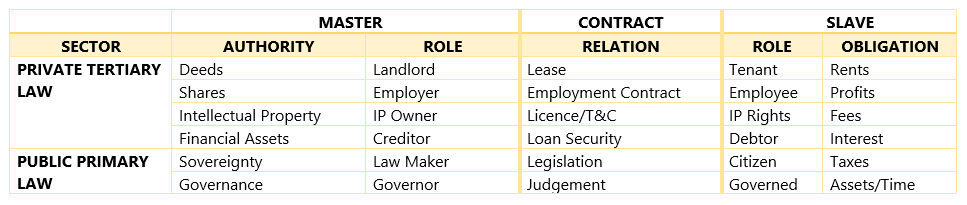
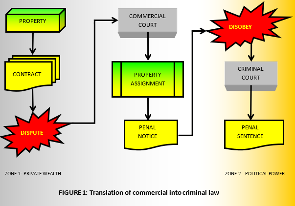
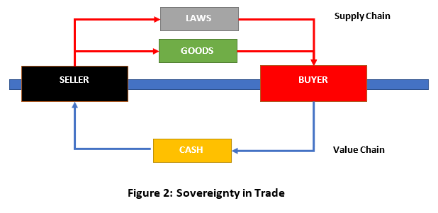
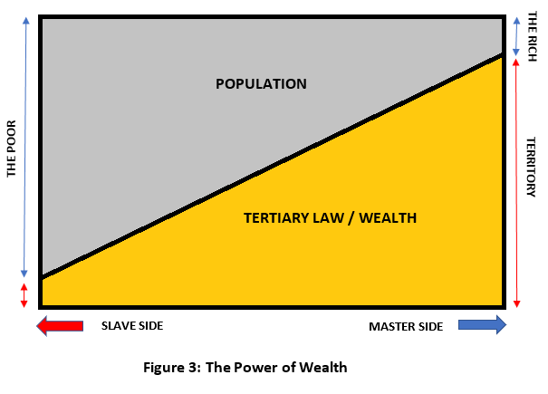

# Trade Control - Commercial Law

Published on 1 May 2021

Every GitHub repository is subject to Intellectual Property Law, but what is its true nature and how can it be defined?  These laws are a global imposition on all members of the United Nations through a system of rules issued by the World Intellectual Property Organisation (WIPO). Nation states may differ in implementation, but the outcome will be the same. I am English. Therefore, I will investigate these rules using the British legal system. 

If you have been following thus far, you will know that my engagement with capitalism, currencies and accounting practices is a consequence of something else. At root it is about an ancient mentality of exploitation and how it is encoded into modern life. That is why the following presentation is not political; since left or right, high or low, the world projected by this mentality is universally accepted. The ideas and history behind [the Trade Control project](https://github.com/tradecontrol) seek engagement with that world, not by opposing, but by direct connection to its centre. 

## Requirements

- [Financial Capitalism](tc_financial_capitalism.md)

## Primary and Secondary Laws

In Britain there are a set of Secondary Laws that authorise certain roles and organisations to make laws. They serve the same function as a written constitution in other states. Making law involves introducing, amending and repealing the set of rules that govern the State. These rules are called Primary Law, which have recognised legitimacy because they are enacted under the authority bestowed by Secondary Law. Citizens are distinguished from State officials by Secondary Law, such that citizens have no authority to make Primary Law. It then divides the State into a set of roles, from High Court Judges and Parliament to lowly civil servants, like the police and tax collectors.   The kind of laws they can introduce into the legal system, if any, are determined by the Rules of Recognition. When new laws pass its test and are introduced, the Rules of Recognition classify their ranking in a hierarchy, constituting the system of rules.  As conflicts occur, the position of the law in the hierarchy determines the prevailing law. By the Rules of Recognition, the only sources defined by Secondary Law that can make Primary Law are Parliament, the Courts and formerly, the EU. The Courts make laws through precedent, Parliament through statutes and the EU through the application of treaties and directives. The Rules of Recognition ranked all laws from the EU above the statutes of Parliament, and all statutes above precedents. Jurisdiction is thus presented with a statement of the law, so it knows how it must be applied. Brexit merely shed the EU from the Rules of Recognition, so the statement of law is released from its Primary Legislation.[^1]

All very fine, but it does not include the most important laws that affect every citizen. I will call these Tertiary Laws to clearly identify them, although this is not a term used in British law.

## Tertiary Law

Tertiary laws are legislated in contracts by private individuals or organisations. These private laws are authorised by the Primary Law of commercial, company, consumer, employment and land law. They are key areas targeted by commerce conducted in the Asset Layer. Because most of the Primary Law relating to contracts is by precedent, with only a few statutes, this 'common law' is embodied in a large set of Cases. Key statutes in British law are:

- Companies Act
- Competition Act
- Consumer Credit Act
- Consumer Protection Act
- Property Act
- Rent Act
- Sale of Goods Act
- Supply of Goods Act
- Unfair Contract Terms Act

Apart from two acts that offer some limitation on citizen abuse, there are only two statutes here that are not related [to assets](tc_assets.md). These describe the terms of trade exchanges, so really, only one statute. All other Primary Law is in the Cases. Which is to say, the Primary Law relating to contracts has been principally determined by the victors of legal disputes over the Tertiary Laws that they themselves had legislated. What are these laws?

### Tertiary Law Defined

Here is a real example of Tertiary Law taken from a standard, legally enforceable employment contract:

>  “You must disclose to the Company any product, know-how, invention or design, and other writing, drawing or similar eye-readable or machine-readable record of knowledge that you create, make or discover whether alone or jointly in the course of your employment with the Company.  Any such Intellectual Property is owned by the Company and you must comply with any reasonable requests from the Company to assist in the preparation and execution of all and any documents necessary for the protection and exploitation of any rights connected with such Intellectual Property in any country in the world.”

As someone who has been self-employed for over 25 years, that clause reads like [a joke](tc_profit_and_loss#incorporation). Almost all Tertiary Laws today are stated in terms of master/slave relations. The words are different, but the nature of the relation is the same. It is important, however, to understand the difference between a relation and an identity. To be a master of slaves is to have dominion over them but give nothing in return. The slave as identity is utterly subjugated by the unitary projection of their master in the form of property. A master/slave relation differs in that it involves an exchange between parties whose identities are neither master nor slave. There is instead a relation that describes the terms of the exchange. We can define it as:

> Tertiary Law describes the rules that demand compliance inside a domain of territorialised productive resource. The source of the unitary projection determines the rule-maker, whilst all interfaces inside its force field determine its rule-takers.

It is self-evident that the State was not invented to protect and enhance the well-being of slaves, but their masters.  Political power, as such, was how these élites managed, from a high level of abstraction, social and economic change to preserve the status quo.  Today, the status quo is a system of balance between relations specified by the contractual framework of Tertiary Law. Balance is obtained when the legislated territory ensures surpluses flow continuously from the slave side to the master side; where those on the master side must be few (maximising their rights to consume), and the slave side both compliant and many (maximising rights to produce).  Any modern State, no matter its ideology, will naturally gravitate to this balance. Whenever a new regime takes power, all Tertiary Laws remain the same because they cannot be altered or repealed. It does not matter what your politics is, Tertiary Law defines your rights and where you are in the pecking order.

Tertiary Law in [the pre-IR era](tc_assets.md#agriculture) was issued from inside a highly polarised hierarchy, like a [Consumer Network](tc_functions.md#consumer-networks) of oppressed subjectivities: The King at the top, his barons and bishops below that, peasants at the bottom, in a Great Chain of Being down to the worms burrowing busily beneath their feet. Most Tertiary Law of the period described relations of ownership to 2d plots of land.  Post-IR Tertiary Law, as you might expect, can be connected in multiple dimensions. For example, when buy-to-let mortgage holders purchase a house (from a Consumer Network of assets), they take possession of (territorialise) the asset (receiving the right to produce). The asset, therefore, gives them the further right (from the State) to issue legislation (Tertiary Law) in the form of Landlord (master)/Tenant (slave) relations to receive rent (rights to consume) from their property ownership (unitary projection). The tenancy agreement then is a gateway of Tertiary Law through which all tenants must pass so that they may obtain their right to a home. However, whist the landlord owns the house, the banks own the debt. To secure the debt, the banks would have in turn issued their own tertiary legislation in the form of a creditor / debtor relation, stating the terms by which their issuance of monetised rights are to be repaid. In this way, the buy-to-let mortgage holder is both master and slave.

The Table of Assets below is provided so that you can find out which side you are on in our ubiquitously territorialised world.

### Tertiary Law Implementation

To separate commercial from criminal and civil law the State must:

- Provide a framework for the legislation of private Tertiary Law
- Permit Tertiary Law to be defined in terms of master/slave relations 
- Institute a judicial infrastructure for translating Tertiary into Primary laws
- Ensure those services are only affordable to the legislators of those laws

The first two requirements have been explained. Before proceeding to the last two, I should provide some historical background.

Two dominant forms of political organisation have reigned in Britain since medieval times: Monarchy and Democracy. The only period without a monarch was a farce known as the Interregnum. It fell between the regicide of Charles I in 1649 during the English Revolution, and the Restoration in 1660. The Interregnum saw a group called the True Levellers, in a one-off exercise of total futility, seek to end the Eon of Man’s Dominion. Since that time both Monarchy and Democracy have been running simultaneously. On the face of it, this is surprising, because according to the Oxford English Dictionary they are diametrically opposed. Monarchy is derived from Greek _monarkhia_ ‘rule by one’. Democracy is from _demokratia_ ‘rule by many’ or _demos_, the people. Like engineering a car that turns left and right at the same time, the British political system bundles along and falls apart, yet miraculously remains as one. How does it do that?

Whilst Wealth is a [measure of rights](tc_assets.md#money) to both produce and consume human and natural resources, Power is a measure of rights to legislate access to those resources and the capacity to enforce them. Monarchies are a relic of [land territorialisation](tc_assets#agriculture). Because they are ‘rule by one’, there is no need to separate Wealth from Power; those measures are the product of a single unitary projection. In a democracy, however, if Wealth and Power were to remain unseparated, what is to stop the ‘rule by many’ re-defining the rights of Wealth in terms other than master/slave relations, issuing legally binding templates that slowly squeeze out such relations from all Tertiary Law? Unfortunately, this cannot happen today because they are kept separate.

To prevent such democracy, the primary legislation for Tertiary Law is encapsulated principally in:

- Court Cases arising from disputes over contracts that protect the assets of its owners. 
- [Intellectual Property](#intellectual-property) law which applies the master/slave relation to transform intellect into tradeable goods
- Various land-based statutes such as the Rent and Property Acts 
- Various commercial statutes such as the Companies and Consumer Credit Acts

Each contract contains laws in clause form that are made up by lawyers at the behest of private owners on the master side of the relation. These laws enable the State to proliferate territory in a hierarchy of Kings, each in their isolated territories where ‘rule by one’ applies in the form of Tertiary Law. Therefore, Britain is a quasi-democracy in the formation of its legislated Primary Law, but it is still monarchic in the formation of Tertiary Law. Who can enforce these monarchic laws other than the ostensibly democratic state? Thus, Power serves Wealth in the formation and execution of Tertiary Law. By embracing lies and hypocrisy, Britain can serve two masters at the same time - 'rule by one' and 'rule by many' - its constitutional monarchy tenaciously persisting in perpetuity - because it symbolizes the true underlying order of things.

> Other 'democracies' have their Presidents, who are just Kings with a limited term (as one US President observed). The mechanism and the symbolism vary, but the outcome is the same.

Because wealth [is a right](#money), realising a true democracy would involve re-writing Secondary Law such that master/slave relations in Tertiary Law were no longer enforceable by the State. Imagine that.

### Tertiary Law Execution

**Figure 1** diagrammatically represents how Tertiary Laws are translated into Primary:

Because signatories on the slave side of contracts have much to complain about, the translation of Tertiary into Primary Law is an intentionally expensive process, way out of reach for the clear majority of the State's citizens. You can issue as much Tertiary Law as you like, but for anything other than trivial disputes in a Small Claims Court, you will not be able to enforce them. 

> In Britain, legal fees are unrecoverable in Small Claims courts. Because legal costs exceed the value of the claim, you must represent yourself. Therefore, if a corporation has stolen your money by breaching the terms of their own contract, there is no legal means provided by the State for its recovery. Their lawyers can merely elevate the dispute to a higher court until the claimant runs out of financial steam. 

Wealthy élites are the set of subjects who have a significant portfolio of assets, the right to make a commercial claim (say £400,000 of expendable cash), and are well versed in the framework that has been specifically designed to protect them.  That is: 

1.	Commercial law is a game with its own rules
2.	The victor is the one who does not run out of financial steam
3.  Money delivers the most important rights anywhere in the world

For that reason, the élites, either individually or incorporated, think long and hard before clashing in a commercial court. Where both parties will not run out of money, it becomes a question of truth. Otherwise, disputes are settled by the Balance of Convenience; a legal term describing the judge’s obligation to balance relief of the claimant against injury to the defendant. However, because in practice the victor is the one who does not run out of financial steam, the Balance of Convenience is a euphemism for the legalised transfer of property from poor to rich. 

Although commercial courts adjudicate over Tertiary Law made by the master side of the contract, it issues Penal Notices that are identical to transgressions against Primary Law. In effect, the Penal Notice is the vehicle whereby Tertiary Law is translated into Primary Law. As shown in **Figure 1**, transgressing the Penal Notice is a criminal offence (a transgression of Primary Law), so the consequences to the recipient are the same as if they had committed a crime. By the Penal Notice, the Tertiary Law in the contract function like laws made in Parliament except applied only to the losing party.

## Sovereignty

The second reason why I have coded a [bitcoin wallet](https://github.com/tradecontrol/bitcoin) concerns sovereignty. A sovereign is a rule-maker by virtue of reigning over the subjects within its territorial boundaries. A Rule is a Law if it can be enforced by the State. In the Asset Layer, when trading across territories, exchange is accompanied by the transmission of associated laws. Because Bitcoin is a stateless technology that digitises cash over a distributed network, it is often marketed as a means for conveying sovereignty, either individual or financial. My [commercial wallet](tc_bitcoin.md) demonstrates that when you plug the currency into the [Production Layer](tc_assets.md#production-layer) this is untrue.

> The rules that underpin the bitcoin design are accepted by consensus. Their source is not sovereignty, which requires the application of a unitary projection. 

The Trade Control [schema design](https://github.com/tradecontrol/sqlnode) works on a principle of [cash polarity](tc_functions.md#cash-polarity). Goods flow up the [supply-chain](tc_functions.md#supply-and-demand), whilst value in the form of money flows down. Inside the node, by flipping polarity I can mirror transaction types. I only need one [Task.tbTask](https://github.com/tradecontrol/sqlnode/blob/master/src/tcNodeDb/Task/Tables/tbTask.sql) table to model sales, works, purchase, projects and miscellaneous tasks. Between nodes, inputs match outputs, and I can plug them together [in a network](https://github.com/tradecontrol/network) to form a globally available trading platform, which I depict in [Figure 6](tc_functions.md#supply-and-demand) of the paper. Because trade is territorialised, we could change the red arrow in that figure from Goods to Laws and it would still work. I simplify this in **Figure 2**.

The figure depicts how Laws are passed up the supply chain with the Goods in exchange for Cash being handed down. This is easily understood by every consumer due to the number of T&Cs they must accept each day whenever they buy stuff online. For clarity, let us make it a purely financial transaction. 

I lend you 10 bitcoin and you agree to pay it back over 1 year in 12 instalments at 20% interest. The Goods is the debt, the Laws are the agreed repayment terms and Cash is the 12 payments. I transfer the debt over the blockchain to your public address, record the Transaction Id and await its return plus interest. Unfortunately, you default on the payment; so, I take you to court, present the contract and related Tx to the judge, who issues a notice that state-backs the rules with instructions for compliance and punishment for failure. For you, my rules have just become The Law.

Both parties are using Bitcoin, but only one is sovereign. For this reason, Mammon cannot save you.

## Wealth and Power

It is well-known that the wealthy influence the legislative process in their favour, to secure assets and embezzle more. Legislation is the enactment of Primary Law, which in today’s Western democracies is mainly influenced through corporate lobbying and party funding. We have already witnessed this throughout the eighteenth century in the [brutal Enclosure Acts](tc_assets.md#agriculture). Here, the landowners who controlled Parliament changed Primary Law to facilitate the enclosures, then issued Tertiary Laws to capitalise their new land. These laws were not enacted in Parliament but made up by the issuers of the contracts - laws that can never be repealed or challenged, circumscribing our common rights forever. If the terms and clauses of these contracts are not laws, then why are the State Courts enforcing them in Penal Notices?

Another well-known fact is the inverse relationship between wealth and population. This is represented in **Figure 3**. The golden segment could represent money, but that is only the most liquid asset. Instead, it represents an increase in territory - a ratio of all corporate and personal assets available. Territory is a [Unitary Interface Projection](tc_assets.md#unitary-interface-projection), and that is why its value extraction must be enforced in terms of master/slave relations. Therefore, the more you succeed in accruing wealth, the more territory you can obtain and the more you legislate to exploit. This vicious circle is the inexorable march of inequality and concentration of wealth.[^2] 

Although **Figure 3** could be equally applied to the Roman Empire, two thousand years later, it is still overwhelmingly accepted without question. When environmentalists appeal to the rich and powerful to stop exploiting the planet (at Global Summits, Davos etc.), they are appealing to those whose entire existence is founded upon the very pillars they are being asked to destroy. What chance, therefore, of success? As with the Romans, they will be delighted to address your concerns. After all, those masters live to serve and serve to live; they make the laws to secure your interest that only they can enforce; and all the rights to human and natural resources end up with them. Good luck with that!

### Intellectual Property

Intellectual Property law (IP) translates a creator’s works into tradeable assets. It achieves this by firstly applying unitary projection onto the creation, determining Intellectual Property Ownership (IPO); and secondly, authorising the owner to legislate its commercialisation in terms of the issuance of Intellectual Property Rights (IPR). Like landlord/tenant tenancy agreements for renting out a plot of land, the Tertiary Law of IP is similarly framed in relations of IPO (landlord) and IPR (tenant). Once externalised, the asset can be separated from the creator and territorialised by any third party. The Company in the [sample Tertiary Law](#tertiary-law-defined) projects a unitary force field in which creation takes place, and therefore determines which side of the IPO/IPR relation parties to any IP contract must fall. However, the employee is even without IPR, because this is signed over in the employment contract - a gateway of Tertiary Law through which all employees must pass so that they may earn their rights to consume).

This system is so entrenched and pervasive that we must spend our whole lives inside the containment fields of others. To step out from this containment field is to project your own. Most labour, therefore, is conducted under the control of Tertiary Law in the form of an employment contract, where labour signs up to the slave side of the relation. For all but menial tasks, these contracts will have an IP clause like our sample. Its purpose is clear.  Creators are unique in that their productive life generates new endogenous zones of transformational power. These zones present newly created planes of abstraction that can be territorialised. Because they are naturally productive, their surpluses will be harvested using the techniques [already described](tc_profit_and_loss.md). However, for IP law to function in practice, it must state that the first owner of the IP is the author. The employment contract circumnavigates this constraint by using IP law to objectify the property, then Company Law to instantaneously transfer the IPO from the author into the ownership of the dominant unitary force. If the creator simply accepts the containment field of unitary projection under which their creativity must occur, they will be well looked after (farmed). In this way, their skills can be scaled to service the will and purposes of the master they serve, from SME to Global Corporation. In consequence, most IP law is exercised, not by creators themselves, but by companies, where IP is traded and commercialised just like any other kind of property; its enforcement cost-prohibitive to all but the select few. In this way, Intellectual Property Law protects the Property whilst enslaving the Intellect.

What is likely to happen if you became a creator, on the margins of society, and from nothing, began to materialise a productive zone of great value - raise its wave and push it out into the commercial world? Unless you are in the Arts, where a direct connection to your audience offers some protection, you will have only two options: either territorialise that wave yourself and patiently watch it capitalise; or watch others ceaselessly territorialise it for you; big fish devouring little fish, until you are a slave in your own product. And should you resist this force, the application of legal violence will fall heavily upon you. One by one all your projections into the world [will be taken away](tc_functions.md#life) and your last possession cast onto the shoes of bankrupt men.

## Outro

Truth cannot be vanquished, only delayed. When truth suffers into existence, the price is high; its cost counted at the moment of revelation.

Fellow traveller, drawn from antiquities deep well, I found you. Such a long journey. Born in the fertile valleys of Mesopotamia and Egypt, your Kings have shaped and ruled our world. If heaven is within, so is hell. Thus earth, that was in heaven, has become the hell that is you. To the beginning you must return, a creature [not of this earth](tc_assets.md#darwin's-square); your golden proboscis lodged into every productive resource. [Pinch that throat](tc_financial_capitalism.md#conclusion) and all your worlds fall into the sea. 

Ending the mentality of exploitation is the single most important thing we could do to secure survival and restore earth. Realistically, only scientists could do that. When will they take up the mantle of responsibility for their inheritance?[^3] All the birds are singing for it; the fish are shoaling in their sea; its waves pound the shoreline, announcing to every living thing that moves on the earth, how they shall soon be free.

## Licence

 

Licenced by Ian Monnox under a [Creative Commons Attribution-NoDerivatives 4.0 International License](http://creativecommons.org/licenses/by-nd/4.0/) 

## Notes

[^1]: Contract Law by Richard Stone 1992
[^2]: Requiem for the American Dream by Noam Chomsky 2015
[^3]: e.g. House of Lords -> House of Science
