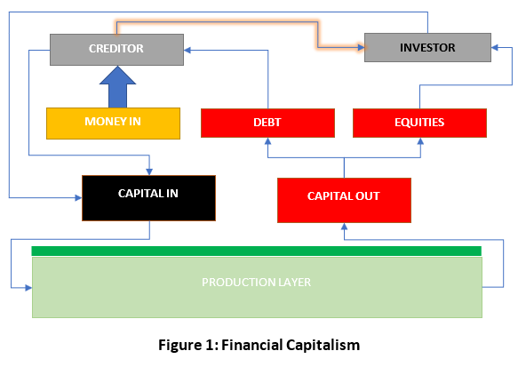
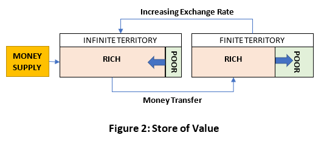
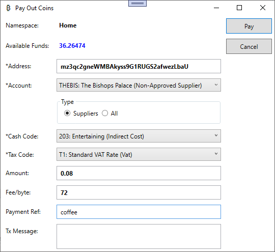
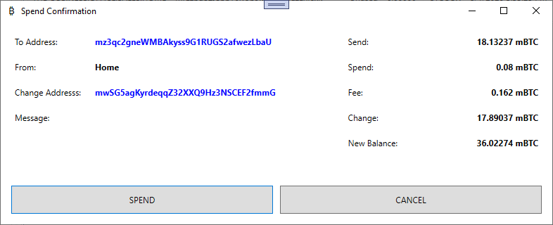

# Trade Control - Financial Capitalism

Published on 14 April 2021

Since the 1980's we have experienced the relentless financialisation of our economy. However, Industrial Capitalism has not been superseded, since the instruments of financial capitalism are still, directly or indirectly, funded off the [balance sheet](tc_balance_sheet.md). In a previous article, I presented a wry take on Trade Control's [commercial bitcoin wallet](tc_bitcoin.md). Between my [intelligence test](tc_functions.md#intelligence-test) and presentation of the [mentality behind assets](tc_assets.md#unitary-interface-projection), there is enough now to venture deeper down that rabbit hole.

## Requirements

- [Commercial Wallet](https://tradecontrol.github.io/tutorials/bitcoin)
- [Industrial Capitalism](tc_industrial_capitalism.md)

## Late Capitalism

In 1986 the UK Government let loose a 'Big Bang' on the London Stock Exchange (LSE). Trade would be liberated from the floor by electronic means in a deregulated environment. At the time, the chairman of the LSE, Sir Nicholas Goodison, sold the changes to the public with the following statement:

> We must never lose sight of that prime purpose of a stock market, which is to serve industry; to make sure that industry can raise capital on the finest possible terms. We have changed our rules for raising capital, but more importantly we have encouraged a great deal more competition to come into this market and competition must be good for industry because it will compete on price.

You can research into those changes, but basically the LSE became a laboratory for investment banks to apply their financial instruments without restraint. The price that competed with existing capital was not new equity, but capital debt. Today that debt outstrips equity; the industrial base of the UK is decimated; and the LSE no longer serves its prime purpose but is instead dominated by two dinosaurs: oil and banks. 

A useful way to understand the unfolding history of the financial markets since the Big Bang is in terms of three related stages:

1. Demote infinite debt and promote finite debt (e.g., shares -> bonds)
2. Replace public with private capital (e.g., public stock -> private equity)
3. Return to gold (e.g., fiat currency -> crypto currency)

The last stage is both uncertain and yet to occur. But following the logic of an asset-based mentality it does make sense.

### Capital Debt

Infinite debt is nothing new. It is the founding instrument behind slavery and rent - debts to an owner that can never be paid off. Industrial Capitalism is a technique for applying infinite debt to a productive entity. From previous articles you will know that to pay off infinite debt [polarity shift](tc_profit_and_loss.md#polarity-inversion) occurs inside the [Capital Layer](tc_assets.md#capital-layer) - the producer/owner rift defined by Company Law. There is [no legal or practical obligation](tc_profit_and_loss.md#capital-extraction) for the business to pay out the debt, because that is up to the owner of its shares. It is why Industrial Capitalism is not responsible for the dynamics of [exponential growth](tc_industrial_capitalism.md#growth).

With finite debt, the polarity shift occurs over the [Asset Layers](tc_assets.md#asset-layer) of two business entities in a debtor/creditor relation defined by Contract Law. When capital is raised in the form of long-term debt, the debtor is legally obliged to pay the creditor both the principle (the amount borrowed) plus interest on the contractually agreed terms. Since these payments are a liability, they must be taken from capital on the balance sheet. That obligation 

a. commits the borrower to ceaseless growth until the debt is paid off; and 
b. syphons off capital into the coffers of the creditor. 

The more capital is syphoned off, the more debt can be issued at an increasingly competitive price, reducing equity capital in proportion to the amount of capital debt. Because this process is orchestrated by the banks, they can accelerate the process by increasing the fiat money supply. In so doing, industry serves the stock market, who are forced to raise capital on the worst possible terms. This negative feedback loop is represented in **Figure 1**.

Since banks and all their ancillaries (hedge funds, asset management firms, VCs etc), are also capitalist entities, they too have an Asset Layer that is owned externally and must declare their balance sheet like everyone else. The capital on the banks’ balance sheet is owned by the shareholders. Therefore, the process of financialising industrial capital is in fact a technique for enriching these owners and the asset portfolios of their clients.

We could redraw [the positive feedback loop](tc_industrial_capitalism.md#producer-price) of Industrial Capitalism, instead showing the negative feedback loop of financial capitalism. There is no point, however, because it would merely show the financial markets sucking the rights to capital out of the production layer. Over time, the economy becomes de-industrialised, and all the money ends up in the banks. Therefore, capital servicing finite debt repayments, not investments, is a kind of anti-capitalism, because Industrial Capital is being systematically eroded by its negative feedback loop.

### Infinite Territory

Money creation issues infinite territory not infinite debt. For example, you [own finite territory](tc_assets#unitary-interface-projection) in the form of property and this bestows a right to legislate upon its use. You draw up a rental agreement which details the terms by which a tenant can obtain access to your territory. Once these laws are accepted by a tenant, they begin to pay off a debt that is without termination. If the debt is not paid, eviction follows, and another tenant takes up the responsibility. Therefore, your tenant must connect to the production layer to service the rent, which is normally via an employment contract issued by a business entity. Both contracts are manifestations of an owner's [UIP](tc_assets.md#unitary-interface-projection), the one [swapping rights to consume](tc_assets.md#money) for labour and the other taking away those rights for providing a home. Your tenant wants to break this cycle by going self-employed but needs start-up funds to buy a van. You offer to lend back the money you obtained from your finite territory in the form of a long-term loan, and issue another contract describing the repayment terms. This capital debt gives your tenant the right to produce, hopefully generating sufficient income to pay the rent. Here, the money supply is tied inextricably to finitude and there is no way you can change that. But central banks, who issue money, can. 

The source of infinite debt is finite territory. Where territory is finite, increasing the money supply causes inflation because you are merely dividing the pie into ever thinner slices. However, if you have access to infinite territory, you can issue money against that and the pie keeps on growing. Because money is an allocation of rights, new money creates new rights, so the question is: who is getting them? Infinite territory (which exists in the future) is created by issuing finite debt by fiat. Finite territory (which exists in the present) is then swallowed up by those who have received the right to do so out of thin air. But the debts keep on piling up.

Because all this infinite territory is in the future, what happens when the burden of the future exceeds the bearing capacity of the present? This future is a unitary projection and therefore cannot be maintained save through a force field of supreme violence (such as the US military, financed from the infinite territory of US bonds[^1]). How can the debtors write off their own debts except down the barrel of a gun? Or through the tried and tested methods of warfare, plunder and theft? But perhaps there is another way.

### Exodus

The impact of capital financialisaton can be felt in the code's [development history](tc_history.md). More importantly, I point out that, even though the derivatives and capital bond markets are so immense, they are nevertheless credited against the Production Layer, because where else are these debts going to be ultimately paid off? That means every tradable asset in the financial system (whether bonds, derivatives or equity) are still either dependent upon, or paid through, capital on the balance sheet. You can stoke the market by increasing the amount of debt available for property assets. But how are these debts going to be paid off except through wages, which is again off the balance sheet, since capital is [assets minus liabilities](tc_balance_sheet.md#capital), and wages are the latter. Thus, finite debts are underpinned and financed by infinite debt, comparable to the age-old ownership of land. For the endgame, as the capital markets are systematically privatised, the many below the Asset Layer will by default be in debt to those few who remain above it, infinitely.

Here is another way to look at the three stages:

1. Liberate territory from finitude - Infinite Debt -> Finite Debt; Finite Money -> Infinite Money 
2. Appropriate and concentrate wealth and power
3. Re-bind the territory - Finite Debt -> Infinite Debt; Infinite Money -> Finite Money

The third stage is often characterised by a return to some kind of gold standard. Trying to sell me gold is like feeding grass to a cat. But I think the reason for the return is a simple one - the need to terminate the unending escalation of debt caused by territorial infinitude. 

**Figure 2** is a process. As the allocation of rights are transferred into finitude, it pushes out the poor. The poor then obtain more rights to an infinite territory which is increasingly worthless (because it is falling into the past).

Crypto currencies are finite and superior to gold in that they have no physical presence. By replacing gold with crypto, the rights of the rich could be re-allocated back to mathematically enforced finitude. That process would be the horror of the world, for once done, how can it be undone? 

## Bitcoin

Bitcoin is the most territorialised of all financial instruments in existence. Indeed, crypto currencies are the only asset class that appear to have no meaningful connectivity to the Production Layer at all. They must be swapped out in an exchange for something that does. Ironically, the entire asset value of bitcoin is currently vested in the exchange rate of the very currencies it is ostensibly set to replace.  

Why can a business not install my [Commercial Wallet](https://tradecontrol.github.io/bitcoin) and start trading with these coins? A non-technical obstacle to adoption is the relentless territorialisation of the currency by the Asset Layer, making it increasingly too expensive to purchase for industrial trade. As the share of the Store of Value is usurped by the Asset Layer, the price of goods and services in the Production Layer gets squeezed, increasing Asset Layer rights to consume and produce whilst decreasing everyone else’s. As this process of territorialisation persists, there is a delay in price discovery (of traded goods, not assets), so the squeeze acts as a deterrent. That is good news for the players in the Asset Layer, because as the coin pushes out other currencies, they will be pre-stacked for the wipe out. 

### Technical Obstacles

Although the idea behind my wallet is generally liked, no-one knows what to do with it; even though it is both connected to the Production Layer as UOA, and can translate productive flows into assets for legal compliance. There are societal reasons for this, but should they be overcome, there are still technical problems that inhibit general adoption by industrial trading bodies, principally the following interconnected issues:

- transaction cost
- transaction rate
- scalability 

> Volatility on the exchanges is often cited as an obstacle to adoption, but that principally relates to its purchase as an asset. Once you are inside that global bubble, who cares what the exchange rate is?

Using a company from the [bitcoin tutorial](https://tradecontrol.github.io/tutorials/installing-bitcoin), I can purchase a coffee in bitcoin (as an entertainment expense), which, at current exchange rates, costs around 0.08mBTC (£1.20 equivalent). I obtain the latest transaction fee from [MinerRates.cs](https://github.com/tradecontrol/bitcoin/blob/master/src/tcBitcoin.Wallet/biz/MinerRates.cs), here running at 72s/byte:

I then construct a transaction from coins inside the Home namespace, assess the size in bytes and request the change from the miner by deducting the accepted fee (here 0.162mBTC - 225 bytes), which costs twice more than the coffee. Even though I added a fee that maximises my chances for the transaction being written into the next block, this only occurs every 10 minutes, and confirmations must be greater than zero before the wallet balance can be updated. 

Many businesses have relatively few transactions, but even if they can stomach these charges, the clearance rate is incredibly slow. Bitcoin can only process several transactions per second, so as the transaction throughput increases, bottlenecks restrict the processing speed, causing a scalability crisis, increasing the fees yet higher. The productive economy requires many thousands of transactions per second. This fact would indicate that the currency is not suitable for trade inside the Production Layer.

### Side Chaining

That constraint, however, does not apply to the Asset Layer. The financial industry sector can plug bitcoin into their exchanges and slowly swallow up all its rights. Eventually, they will be able to peg tokens to their Store of Value and mete out the crumbs to the minions.
However, for those brought up on the nano speeds of High Frequency Trading, a few thousand uncertain transactions every ten minutes must be torture. 

By way of remedy, the financial industry sector has been developing a solution called Side-Chaining, most notably the Lightning Network[^2]. Its purpose is to facilitate arbitrage, front-running protection, OTC asset swapping, asset-backed crypto and gaming tokens. However, if I [plug a side-chain into the Production Layer](https://www.tradecontrol.online/developments) by integrating it into the commercial wallet, I can overcome the technical obstacles to adoption.

A sidechain is a bi-directional payment channel seeded with a funding transaction from the MainNet. It holds a network of committed transactions off chain using tokens pegged to the funding transaction. To redeem the tokens, the latest state of the blockchain is mined into the MainNet with a settlement transaction. Because the off-chain blockchain is not constrained by Proof-of-Work, payments can be committed at high speed with low (or no) fees.

There are two main problems that have been resolved by the Lightning Network:

1. responsibility for maintaining the sidechain
2. redeeming the latest state in the settlement transaction

The first involves forming a Federation of ostensibly un-related parties. The second can be read about in their paper. For my purposes, the security dimension of the network has been massively over-engineered, which is a good thing. The reason is financial trading. Because it is disconnected from the Production Layer, it is susceptible to theft and misuse. When exchanging goods and services, payment is a trivial post-fact transaction mapped to an orchestrated supply. I reflect this in [the Solidity contracts](https://tradecontrol.github.io/network) that connect businesses together into supply-chains. My implementation plan can therefore be in stages.
The easiest approach is to introduce a new CoinTypeCode in [Cash.tbCoinType](https://github.com/TradeControl/sqlnode/tree/master/src/tcNodeDb/Cash/Tables) called Lightning. I then map the funding and settlement transactions using the same mechanism for transferring money between bank accounts. That should work. A better approach, however, would be to use the Open-Source technology that underpins the Lightning Network to write something specifically for the Production Layer, wherein consortiums can peg their own tokens to the BTC blockchain.

### The MainNet

The disassociation of the Production Layer from hard currency is a committed orchestration by the occupants of the Asset Layer. Given their mentality, it is a prize they cannot refuse: a pool of [UIP purity](tc_assets.md#unitary-interface-projection) sealed off from earthly processes, territory immutably expressed by maths and logic, a Store of Value transferable into the God-Given rights of dominion - over the fish of the sea, over the birds of the air, and over every living thing that moves on earth[^3].

Only Asset Man could be counted on to scale this perfect form of money. Now that project is more-or-less complete, here is a question that interests me.

I have already released a bitcoin wallet rooted in production, yet fully plugged into the capitalist system. You can trace the code from the [orchestration of workflows](tc_functions.md#workflow), through [the various layers](tc_assets.md#capital-creation), to the [calculation of capital](tc_balance_sheet.md#capital) itself. When I remove the technical obstacles to adoption by re-assigning side-chaining from the financial to the industrial market, the tokens of consortiums must peg to bitcoin, ensuring that the [Allocation of Rights](tc_assets.md#money) are bound to finitude. 
Yet bitcoin runs on two networks, the MainNet and the TestNet. Coins in the TestNet are worthless and the MainNet is [a cadastral](tc_assets.md#cadastral). Therefore, beneath its unitary interface should be a productive resource to exploit (such as the Nile Delta or a corporation). Yet because the MainNet is disconnected from production, there is nothing for the Asset Layer to exploit, except each other through [price discovery](tc_industrial_capitalism.md#competition). That is why it is not fundamentally about exploitation, but [a return to finitude](#step-3), where all the rights are bound irreversibly to the rich. In that light, I ask myself the following question:

Why should commoners like me believe in the polluted MainNet when it has been utterly territorialised by those whose business it is to exploit us? After all, the creator of the coinage does not believe in it either. And should that identity return, what will you do then? Bitcoin may be the hardest money devised, harder yet than gold; but unlike gold, like the TestNet, it can be re-booted.

## Conclusion

In the Production Layer, transformations across [spatial](tc_functions.md#object-structure) and [temporal](tc_functions.md#production-process) workflows never converge in a single point of connectivity. The networks of [production](tc_functions.md#production-network) and [consumption](tc_functions.md#consumer-network) are an ecology of ever evolving relations. It is incredible to think that the controlling forces of our world are the exact opposite of this arrangement. Accounting systems do not encapsulate the unitary connectivity of the Asset Layer onto its host. However, the code I have gifted you does.

See how those mighty citadels spin upon [the slender thread](https://github.com/tradecontrol/sqlnode/blob/master/src/tcNodeDb/Cash/Views/vwBalanceSheet.sql).

Here is something else to ponder upon:

Compare [the positive feedback loop](tc_industrial_capitalism.md#producer-price) of Industrial Capitalism to the corresponding [Figure 7](tc_functions.md#tools) in my theory that describes the Production Network. It reveals how there is in fact a functional connection between supply-chains inside the Production Layer. It is capitalism itself that keeps the [consumer price](#consumer-price) too low. Therefore, with a different mentality, you could implement a virtuous circle to replace the key purpose of Industrial Capitalism - financing innovation.

## Licence

 

Licenced by Ian Monnox under a [Creative Commons Attribution-NoDerivatives 4.0 International License](http://creativecommons.org/licenses/by-nd/4.0/)

## References

[^1]: Super Imperialism. Michael Hudson 1972.
[^2]: The Bitcoin Lightning Network. Poon and Dryja 2016.
[^3]: The Pentateuch, Genesis 1.28
