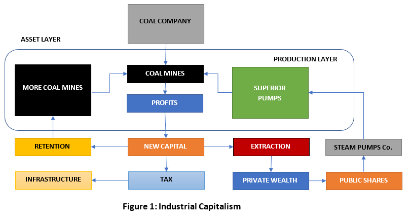
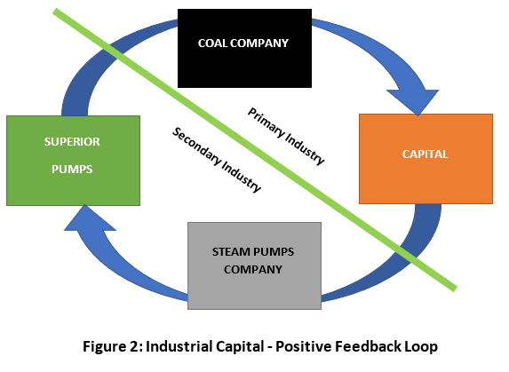

# Trade Control - Industrial Capitalism

Published on 26 March 2021

The functional and conceptual dimensions of capitalism are rooted in the [Industrial Revolution](tc_assets.md#industry) (IR). Firstly, industry applies science and engineering to produce functioning technology (modelled by [workflows](tc_functions.md#workflow)); and secondly, it must apply commercial instruments to create the markets where they can be distributed and sold (orchestrated in [supply-chains](tc_functions.md#supply-and-demand)). The market is fuelled by splitting into two: one for exchanging goods and services, the other for [trading shares in stock](tc_assets.md#asset-man). This arrangement is called Industrial Capitalism, clearly serviced in the Trade Control node. Therefore, you can obtain practical knowledge of these three requirements from the following tutorials: 

1. Workflow - [bills of materials](https://tradecontrol.github.io/tutorials/manufacturing)
2. Supply Chains - [networking nodes](https://tradecontrol.github.io/tutorials/network) 
3. Capital - [balance sheets](https://tradecontrol.github.io/tutorials/balance-sheet) 

Industrial Capitalism is highly market orientated, which means it must evolve mechanisms for price discovery. The external [asset layer](tc_assets.md#asset-layer) enters production in order to achieve that. The Trade Control node re-encodes this internal mechanism, and the following article explains how and why.

## Requirements

- [Job Costing](https://tradecontrol.github.io/tutorials/manufacturing#job-costing)
- [Assets](tc_assets.md)

## Early Capitalism

If you research into capitalism, you will discover many different incarnations. In terms of mechanics, however, there is only one form for the [creation of capital](tc_balance_sheet.md#capital), which is called Industrial Capitalism; a product of the Industrial Revolution and the investment techniques devised by early pioneers like the Dutch East India Company (1600's). 

**Figure 1** provides you with an example of Industrial Capitalism, which I take from the period.

One of the problems before the IR was mine flooding. Without pumps, the water would have to be winched out in buckets, rendering many seams inaccessible. The invention of Industrial Capitalism could help solve this problem by connecting supply chains, such that surpluses from the [Primary Industry](tc_functions.md#materials) could finance innovations in the [Secondary](tc_functions.md#consumer-networks) and vice versa. In **Figure 1**, you can see how this works. The best place to start is [Company Profit](tc_profit_and_loss.md) because that is where the wealth is initially generated. Profit is dependent upon getting a good price for your wares.

> **Note**
>
> My example is not intended to be an accurate depiction of coal mining during this time, but to illustrate why capitalism facilitated the Industrial Revolution.

## Price Discovery

For trade to occur, there must be a mechanism to obtain the price of the objects traded. I want to demonstrate that price discovery takes on a different form in [Consumer Networks](tc_functions.md#consumer-network) than it does in [Production Networks](tc_functions.md#production-network). Firstly, I show how there are no viable mechanisms in the instruments of capitalism for price discovery in the Consumer Network, which I call the Consumer Price. Here we are concerned with the creation of capital, which involves the production and consumption of tradable objects in the form of goods and services. Secondly, the Financial Markets trade in assets (in the form of shares, debt, currencies and commodities) and have evolved their own mechanisms for price discovery. The Stock Market trades in [businesses as assets](tc_assets.md#financial-trading) and the price they discover I call the Producer Price. Here, there is no production layer and no exchange of goods, so only monetary profit determines the price. Price discovery for consumer and producer prices are therefore totally different.

## Consumer Price

To obtain the price, the coal business must establish the achievable margin (price minus cost), which in the Primary Industry relates to raw output, whilst in the Secondary Industry it [relates to jobs](https://tradecontrol.github.io/tutorials/manufacturing#project-schedule). The margin is derived from two questions:

1. Given the cost, what price must we charge per unit of output to make a profit? 
2. Given our competition, how much margin can we get away with? 

### Production Cost

The answer to the first question can only be found in the Production Layer. However, the Recording Surface of [Chartered Accounting](#chartered-accounting) ([ICAEW](https://en.wikipedia.org/wiki/Institute_of_Chartered_Accountants_in_England_and_Wales)) seals this off, so price discovery is inaccessible. Since businesses need this service, the accounting profession has evolved a separate discipline called Management Accounting, embodying its services in a separate institution ([CIMA](https://en.wikipedia.org/wiki/Chartered_Institute_of_Management_Accountants)).  Their methods seek to establish costs so that prices can be set to yield the budgeted capital provided by the Chartered Accountant.  Manufacturers are legally obliged to apply these methods, in [establishing stock movement](https://tradecontrol.github.io//tutorials/balance_sheet#current-assets) for their P&L and balance sheet. Here, budgeted capital is replaced with historical capital, but the calculations are otherwise the same.

Whilst the [Asset Layer](tc_assets.md#asset-layer) is external to the [Production Layer](tc_assets.md#production-layer), deriving capital from the sealed off recording surface of DEBK, the numbers add up. However, as the methods of the Asset Layer enter production to assess cost, the numbers do not. Since the 1990's, it has been widely understood that these costs are an ineffective tool for price discovery. The reason for that is a simple one. They are untrue.  

Determining the cost of a product is not straight forward for many reasons, such as: 

- Not all the costs in a business can be associated with its products. These are called Overheads, such as R&D, Management and Sales.
- Many costs support production and therefore do not relate to a particular product. These are Indirect Costs, such as machine tools, tooling, maintenance and stock control.
- Direct Costs are distributed over [component interfaces](tc_functions.md#components), such that the production of one component may feed several and each one of those may feed several more.
- The unit of sale is seldom the unit of production, called batching. For example, a food producer will not manufacture boxes of cornflakes (grams), but cornflakes for boxes (tonnes).
- Budgeted costs are unlikely to correlate with actual costs because the future cannot be accurately predicted.
- Material purchases are subject to price fluctuations.
- Production constantly diverges from plan - different material suppliers, alternative machine tools, setter capabilities, batch size and so on.

The following section describes the method by which costs have been traditionally calculated. I explain the flaws and present the ideas behind [my alternative approach](https://tradecontrol.github.io/tutorials/manufacturing#job-costing).

#### Cost Accounting

Cost Accounting is derived from the Asset Layer. Therefore it is an implementation that serves a [Unitary Interface Projection](tc_assets#unitary-interface-projection), visible in its use for the [evaluation of stock](https://tradecontrol.github.io/tutorials/balance-sheet#current-assets) on the balance sheet, but also in the techniques by which cost is ascertained. Different techniques exist but having designed and coded several cost accounting systems in the past, they are all riffs on the same theme. 

Traditional costing adds purchases to the cost of production. To calculate the latter, hourly rates for each resource are multiplied by the amount of time spent producing the job. There are many issues that relate to this approach, but the principal problem is in the setting of the rates. Many business costs are not directly attributable to the service or product sold, but these must be absorbed in the cost for price discovery. The hourly rate therefore is dependent upon either historical or budgeted productive time and costs. The latter can be verified and is therefore useful for assessing the asset value of stock (taken at a point in time when productive workflow is stopped). However, the future never mirrors the past. Not only are prices set by traditional budgeted costing likely to be proven wrong by time, but they are often fixed inflexibly by accountants for entire financial years. Therefore, the financial source of the rates is either historical (called *fitting* in Machine Learning), or an inflexible budget drawn from trial accounts (a crystal ball).

#### Gestalt Costing

During the 80s I was responsible for supplying the cost framework for price discovery in a factory. I bought the CIMA manuals and, just as I did for DEBK, I worked out the rates and costs manually on paper so I could see exactly how it worked. I then wrote code that traversed the entire MRP system to reconcile the calculated costs with the accounts. No matter how hard I tried, I could never get to the truth. I concluded that there is no true cost that can be assigned directly to an individual component or assembly. It is a myth. 

My solution to this problem begins by replacing the [recording surface projected by the Asset Layer](tc_balance_sheet.md#double-entry-book-keeping) with a recording surface from production rooted in [Supply and Demand](https://tradecontrol.github.io/tutorials/manufacturing#organisation-statement) (SvD). This re-connects the disassociation of Asset and Production Layer recording (Chartered/Management Accounting), speeding everything up to transaction-grained levels of sensitivity. 
 
Turning to the [Bill of Materials tutorial](https://tradecontrol.github.io/tutorials/manufacturing#project-schedule), you can model any kind of workflow, from a simple service to an aeroplane. But what is its cost? The [job costing code](https://github.com/tradecontrol/sqlnode/blob/master/src/tcNodeDb/Task/Views/vwProfit.sql) recurses over the workflow and establishes the direct cost of purchases, which is a true cost defining throughput. But how do you ascribe cost to its production?  When hypothetical workflows are dropped onto the SvD recording surface, like the aeroplane with its many components and materials, the overall business plan is more-or-less instantaneously modified to communicate affordability.

Firstly, I create a base from which to derive both live and hypothetical scenarios:

- [Cash.vwStatementBase](https://github.com/tradecontrol/sqlnode/blob/master/src/tcNodeDb/Cash/Views/vwStatementBase.sql)

Then I integrate the quotations, their vat and company tax, into the company statement:

- [Cash.vwStatementWhatIf](https://github.com/tradecontrol/sqlnode/blob/master/src/tcNodeDb/Cash/Views/vwStatementWhatIf.sql) 

Let us say sales cease abruptly (due to a pandemic) and you were asked to quote for just one job. The [Trade Control costing system](https://tradecontrol.github.io/tutorials/manufacturing#pricing-and-scheduling) immediately communicates the true cost of that one job, whereas the hourly rates would yield a false result.  It also means that this recording surface would allow me to apply finite scheduling algorithms on production capacity and purchasing in relation to a company’s overall financial commitments in real time. And because each business is also modelled as a node, it could also traverse the supply-chain.  

Using this method, once you have established the job’s purchase cost (where the margin is zero) you consult the impact on the overall production schedule. If the Company Statement is entering negative territory in your forward projected balance, you know that your prices are too low to cover your costs. That may just be another job that requires an expensive purchasing commitment, so you would either need to re-schedule, charge more or discuss payment terms. In this way, the cost varies depending on all your other commitments. Once you have discovered this truth, you can flexibly assess the competition. 

Gestalt costing is derived from the Production Layer and cannot be used for asset evaluation. 

## Competition

In finance, price and its discovery are everything, because asset value is all there is. That is not a sensible position to take in the real world. For example, installing a high-pressure tank in an exposed area requires the presence of a safety valve. If you install a cheap copy and the tank explodes causing fatalities, you may discover the real price by ending up in jail. In this instance, prices almost always support production cost unless the market is being manipulated. Market manipulation reveals how price discovery should work in a competitive environment. The two most common forms are applied by state or large corporations, since it requires considerable fire power.

Nation states manipulate the price discovery mechanism by subsidising industries so that they can sell into the international market below cost. Once the industry is established and the competition wiped, it is free to apply price increases to cover costs and generate capital for the owners and new taxes for the erring state.

Another form of manipulation occurs when hard-core capitalist entities like supermarkets seek to expand into new markets. In Britain, bread was traditionally sold in small bakeries for sums established by the price discovery mechanism. However, supermarkets could sell bread below cost by diverting profits from their other produce. Once bread shops became a rarity and the competition destroyed, they could put the price back up.

In free markets, competition deflates prices whilst cost inflates them. They inversely relate to the quality of the goods sold or to production efficiency. For example, if competition is deflating the price but quality is maintained, efficiency of production must be increasing. Or if costs are inflating and competition is not deflating the price, quality must be going up.

> **Note**
> 
> Since capitalists own the means of production, they can distort this equation through corruption and monopoly. But those markets are normally illegal because they are not free.

## Producer Price

Returning to **Figure 1**, what is the price discovery method for the pump? Before the IR, water was removed from the mines by manual means; initially buckets and winches, then pumps powered by horses or cattle. Applying the Consumer Price Discovery method we used for the coal, the price for the pumps will be ceaselessly minimised by the competition. Therefore, there will be insufficient funds available to the pump producer to improve their product. But why does the Coal Company not just accept higher prices if they would benefit from superior pumps?  In an economy founded on Industrial Capitalism, the shares would have different owners. To accept the higher price would decrease the capital on the buyer’s balance sheet, whilst increasing it on the sellers. 

Overcoming this problem is where capitalism comes into its own. Price discovery across the production network is not just the price of the tool, but also the price of the shares, called stock value, presented by the Asset Layer in **Figure 2**.

Shares in the pump company are made publicly available. The owners of the coal mines can then transfer some of their extracted wealth into the other supply-chain to stimulate innovation in steam pump technology. As the benefits of improved water extraction to the mining industry are easy to appreciate, the stock price will increase as investors from other supply-chains (and wealthy landowners) purchase more shares, accelerating the innovation process. Once the pumps are being traded, the shareholders can extract dividends off the balance sheet. The output of the coal mine increases, yielding more capital that can either be retained to grow the Coal Company (infrastructure, more mines etc.) or extracted for private wealth and further investment (maybe rail stock next time). You end up with the positive feedback loop represented in **Figure 2**, which is just another representation of **Figure 1**; a kind of unvirtuous circle.  

### Growth

There is often the assertion that capitalism encourages unsustainable, exponential growth. Since earth is finite, it has caused the unfettered exploitation of resources, resulting in environmental meltdown. However, looking at the mechanics of Industrial Capitalism, I do not see any justification for this. Growth during the IR was not that significant, and the explosion during the nineteenth century was a period of intense industrialisation; caused, not by the mechanics, but by the possibilities it presented. 

Growth stimulation occurs in Industrial Capitalism when [Consumer Price Discovery](#consumer-price) is unable to find the right price. The Consumer Price is not connected to the capitalist system, for it is as old as time. In the example presented in **Figure 1**, the price the coal company paid for the pumps was insufficient to finance its productive potential. It was too low. Capitalism then offers an alternative price discovery method, which is the price of the pump company's shares. [Producer Price Discovery](#producer-price) is orchestrated in a different marketplace, called the Stock Market. Initially the share price is speculative, rising higher as they yield returns [off the P&L](tc_profit_and_loss.md#capital-extraction). However, over time the competitive advantage of the innovation drops off as alternative suppliers emerge. The dynamics of the consumer price discovery kicks in, deflating the price. Stock value drops in proportion to the drop in capital yield. Growth grinds to a halt. Eventually the share price becomes so low, a private investor buys them up because the company's balance sheet looks good, even though the profits suck.  It leaves the stock exchange, yet continues to supply a useful, needed product, where the consumer price finances its own micro improvements to product design. Intellectual Property rights in the form of patents merely delay the inevitable. This is not the fate of every company of course, but the positive feedback loop of Industrial Capitalism is not without end, because it is tied inextricably to the finitude of the Production Layer. 

## Conclusion

Capitalism moved on to new forms during the late twentieth century. Yet this older form of capitalism is foundational. If you removed it, all the modern derived forms would fall away.

There is a kind of elegance in this game-playing application of greed, but it could never last; for greed consumes the thing it loves until it is no more. I began working in factories during the year of the [Big Bang](https://en.wikipedia.org/wiki/Big_Bang_(financial_markets)) in 1986, when financial markets liberated themselves from the constraints of production. My subsequent 30 years inside the factory witnessed those born of Industrial Capitalism systematically eat it alive. And yet capitalism was created by the application of [landowner mentality](tc_assets.md#agriculture) to the [Industrial Revolution](tc_assets.md#industry). Since that application is embodied in the [calculation of capital](tc_profit_and_loss.md#polarity-inversion) itself, these origins cannot be escaped. Thus, anatomising the [mechanics of exploitation](tc_balance_sheet.md) is to peer into its soul as though through glass. And like [Prince Rupert’s Drop](https://en.wikipedia.org/wiki/Prince_Rupert%27s_drop) bearing a thousand hammer blows, one gentle tap at the right place, a million fragments explode. 

Should you wish to be that hand, where will you find it?

## Licence

 

Licenced by Ian Monnox under a [Creative Commons Attribution-NoDerivatives 4.0 International License](http://creativecommons.org/licenses/by-nd/4.0/)
