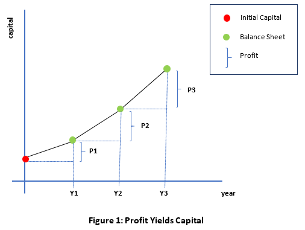
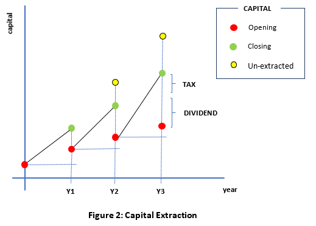
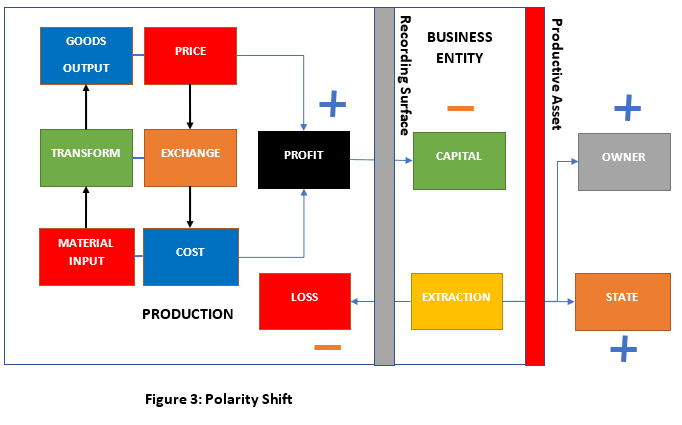

# Trade Control - Profit and Loss

Published on 18 December 2020

When concluding the section on [Balance Sheets](tc_balance_sheet.md#conclusion), I said there was a polarity shift between the reporting of capital and the recording of trading profits. Here I explore the mechanics for implementing that shift by explaining the practical implementation of the three stages necessary for [capital calculation](tc_balance_sheet.md#capital). 

1. The Asset Recording Surface of accounting systems is implemented using double-entry book-keeping (DEBK) and has been for hundreds of years. I replicate this recording surface by deriving it from productive transactions.
2. I calculate capital value directly, but accounting systems obtain changes to capital from the Profit and Loss Account (P&L) 
3. The perimeter of a [Trade Control node](https://tradecontrol.github.io/tutorials/installing-sqlnode) is defined as a Business Entity by Company Law. Each entity is an externally owned asset. When you connect them together in [a trading network](https://tradecontrol.github.io/network), transactions occur across their respective interfaces. Accountants transcribe these transactions onto their Asset Recording Surface and thereby calculate the value of the business to its owners. 

## Requirements

- [Balance Sheets](tc_balance_sheet.md)

## Chartered Accounting

To replicate the services provided by Chartered Accounting I must provide an alternative to these three stages inside the Trade Control node: the recording surface, the capital calculation and evaluation of assets. Chartered Accounts report to the business owners who want the answer to two simple questions:

-	What is the current asset value of my business?
-	How much money can I extract?

The first question is answered by the Balance Sheet; the second by the P&L. Chartered Accounting constructs them from the medieval practice of double-entry book-keeping (DEBK), originating around c13. From the DEBK ledgers they first construct a P&L, then derive the Balance Sheet by adding the profit to the capital account. In so doing, not only do all accounting packages work off DEBK, the whole edifice of the modern financial markets and world trade still rest upon its ancient and humble shoulders. Although that is the case, like the capital calculation on the balance sheet, DEBK is seldom mentioned in the literature on capitalism. Trade Control is able to dispense with DEBK yet still answer these two questions.

### Double-Entry Book-Keeping

Business transactions are separated from personal transactions by the business entity. DEBK records the transactions of the business entity so that its position can be reported upon, to its owners and the government, through the presentation of accounts. When a business entity is formed, a personal transaction by the owner is made into the business entity, constituting the owner's initial capital. 

As the business trades in the marketplace, DEBK applies the measurement of money to all transactions and records them in various ledgers. The ledgers provide the means to calculate how much money can be extracted from the business in dividends (like an annual harvest in agriculture), and how much capital is currently available (like farmland). The first is called the Profit and Loss Account (P&L), the second the Balance Sheet. The Balance Sheet is an add-on to DEBK and is normally considered to be a part of the Accounts. It accommodates for the fact that modern commercial economies treat businesses as tradable assets, sold privately or publicly in Stock Markets. 

Capital is the amount a business is worth to its owner. The P&L calculates the annual increase in profits that can be added to the owner’s capital.  In the Balance Sheet, the owner’s capital and other liabilities are measured against business assets to establish its book value. Double entry ensures that assets minus liabilities is always zero. 

Assets can be current or fixed, the latter being tangible such as buildings and equipment, or intangible such as the value of a brand name. Current assets are also known as circulating assets because they are the objects of trade and cash. The sale and purchase of current assets is indelibly recorded in the DEBK records and cannot be altered.  Fixed assets are so described because they must remain locked in the business to facilitate trade. When a fixed asset is purchased, it is entered on the DEBK ledgers as an asset but balanced against a capital or cash liability. Net capital gain is therefore zero. When a current asset is manufactured but not yet sold, it cannot be entered on any ledger, so again no net capital gain. To resolve this shortcoming, various capital instruments have been evolved to manipulate the assets on the Balance Sheet. In this way, accountants can, at the behest of business owners, apply their dark arts to inflate or deflate capital by redefining the assets of their businesses.

#### Business Entity

The first act in forming a business entity is to clearly demarcate the territorial boundaries of production and consumption. This is orchestrated by the State, whereby it issues productive rights to its subjects and lends them coercive capacity to enforce a territorial force field on their consumers (such as T&C). The conditions for obtaining the State's coercive power are laid out in Company Law. A territorial interface is projected upon some potentially productive domain inside a [Spatial Workflow](tc_functions.md#object-structure). In so doing, a plot of territory is brought into being, its extent defined by the amount of money outlaid. The amount can be divvied up among one or more owners, describing the amount of territory they own, called a share.  A share, therefore, is a measure of territorialisation: like land divided into lots of small plots, each of which can be owned separately. Owners, therefore, do not need to be present in or contribute to the productive domain to benefit from its output. Like landlords, they exist outside the interface of their territory. Ownership of a productive resource is equivalent to an infinite debt (one that can never be paid off), like rent.

The territorial boundaries of the Business Entity determine the [Trade Control nodes](https://tradecontrol.github.io/tutorials/installing-sqlnode) and how they must [network](https://tradecontrol.github.io/network).

#### Incorporation

In Britain, a business entity must be initially registered with the State at Companies House who assign a unique reference to its Company Name, called the Company Number. Trade Control's number is 07569044.  The business entity is an [Organisation](tc_functions.md#organisations). It must be associated with a specific location, called the registered address; its owners listed with their opening share capital; then accompanied by a list of Directors who are legally responsible for serving the interest of these owners. Every business entity must first submit a Memorandum of Association according to the Companies Act. This legal document specifies the company name and registered address, and then a section called “The Objects for which the Company is established”, describing the intended extent and type of commercial operations, which are normally very vague. Following are lots of clauses about shares, property, patents and loans etc, to territorialise the entity. The Memorandum declares that the liability of its members is limited, how many shares are being issued at what price, and a statement of right to modify the share structure and how to pay out dividends in the future.

Finally, the subscriber must sign the memorandum with something like my declaration for Trade Control Ltd:

> I, the person whose name and address is subscribed, am desirous of being formed into a Company, in pursuance of this Memorandum of Association, and I agree to take the number of shares in the capital of the Company as set opposite my name.  

Once you pay a small administration fee, you have got yourself a little plot of commercial territory upon which you can plant your company logo. Unfortunately, if you have only purchased one pounds worth of rights to produce, like company number 07569044, the initial application of your newfound rights will be far more limited than any of your potential liabilities. Nevertheless, your new organisation, like [the Bell Foundry](tc_functions.md#organisation-structure) encountered in Functions, is now a subject set to project its intended purpose into the world.

#### Debt

The Balance Sheet is calculated by deducting liabilities from assets and is therefore described by property and debt. Asset comes from Latin _ad satis_ which means _to have enough_, so it is the amount of property that can be used to cover debt. Liability comes from _ligare_, to bind, so a liability is the binding of responsibility to a debt. Thus, the accounting system does not serve the business as a productive resource, but the capital of its owners: calculating how much they can withdraw from the business, sell their property for, or leverage its value to obtain business loans. 

A loan is like a finite share, but the binding responsibility is relinquished once it is paid off. Because they are defined in terms of creditor/debtor relations, debts too can be traded like land; being an asset to the creditor, but a liability to the debtor. Thus, productive domains are territorialised by both its shareholders and creditors, the former being an infinite debt, the latter finite. Both are entered on the Balance Sheet as liabilities to the business: infinite debts in the equity section, finite debts in current liabilities. Each has a balancing entry in the DEBK ledgers. The liability is in return for a new investments that can be used to purchase the means of production, thereby transforming debt into assets. Production uses those assets to increase the debt.

Serving this interests of the Owner conditions the presentation of the business’s productive resources, and this is most visible in the Balance Sheet.  Here is a simple example:

+------------------+----------+------------------+----------+
| ASSETS           | £'000    | LIABILITIES      | £'000    |
+==================+==========+==================+==========+
| Factory          | 1000     | Capital          | 800      |
+------------------+----------+------------------+----------+
| Plant            | 450      | Net Profit       | 100      |
+------------------+----------+------------------+----------+
| Vehicles         | 10       | Drawings         | (50)     |
+------------------+----------+------------------+----------+
| Stock            | 100      | Bank Loan        | 800      |
+------------------+----------+------------------+----------+
| Debtors          | 300      | Creditors        | 200      |
+------------------+----------+------------------+----------+
| Cash             | 10       | Bank Overdraft   | 20       |
+------------------+----------+------------------+----------+
| **TOTAL**        | **1870** |                  | **1870** |
+------------------+----------+------------------+----------+

Assets are listed in increasing order of liquidity. The most expensive, immovable stuff at the top (the £1000k factory) down to the most liquid stuff at the bottom (the £10k of cash). The ordering is to make it easy for Owners, Investors and Buyers to quickly assess the value of the company as a tradable commodity. The top three in the example are Fixed Assets which are subject to Depreciation, the bottom three are Current Assets which, cash aside, are subject to Obsolescence and Bad Debt.  

An asset can be regarded as the territorialised root node of a [Spatial Workflow](tc_functions.md#object-structure) that expresses [a UI](tc_functions.md#interfaces). The asset column of the Balance Sheet is a simple list of these root nodes, in order of worth. Production is therefore entirely absent from this side of the statement.

Capital is an asset to the Owner, but a liability to the business. Production pumps monetary rights into the company's liabilities in the form of Net Profit (£100k), which can then be extracted in dividends (£50k). The business has a remaining £850k of infinite debt (equity section) and £1020k of finite debt (current liabilities). 

Because capital is the debt a business owes to its owner, Capitalism is the technology by which that debt is ceaselessly increased.

#### Capital Extraction

Once a [business entity](#business-entity) is defined, owners can enact their own legislation regarding the business entities interfaces, issuing contractual rights to their users. Consumers do not emit a territorial force field. They obtain value in acts of monetary exchange where they sacrifice some of their accrued earnings in exchange for connection to a specific interface. In other words, in accordance with polarity, rights to consume are passed down the consumer network, whilst the objects of consumption are handed over in the opposite direction. Since industrial production is the art of making something for less than you get for it, the seller's rights to consume increase.

Commercial rights are expressed in money and are therefore utterly portable. However, because production unfolds in time, unlike land, it is a highly volatile, discrete value, subject to transaction level changes. This is solved by imposing spatial territory onto the [Temporal Workflow](tc_functions.md#production-process) called the Financial Year; but unlike the yearly unit of agriculture, the Financial Year is an arbitrary time span since technological production is not tied to the earth's spatial orbit. 

Time is modelled in [App.tbYear](https://github.com/tradecontrol/sqlnode/blob/master/src/tcNodeDb/App/Tables/tbYear.sql) and [App.tbYearPeriod](https://github.com/tradecontrol/sqlnode/blob/master/src/tcNodeDb/App/Tables/tbYearPeriod.sql), which can start at any month. The periods are used for the calculation of profit and loss, capital, vat and corporation tax. I also use them for presenting the Invoice Register, Cash Statements, Job Profit and BI reporting.

The Financial Year has now become a legal obligation imposed upon every business by the State. The reason for its universal application is simply that, in exchange for the coercive force field required by the shareholder to secure territory, the State takes a cut of the surpluses over the Financial Year by grafting itself onto the annual harvest of the business's capital. This is the tax that accountants seek to avoid by applying the dark arts of tax avoidance. Ironically, it is also the tax that anti-capitalist campaigners complain about when the accountants of big business are successful.

**Figure 1** illustrates the connection between capital, the Balance Sheet and the P&L extracted from the DEBK derived accounts. The graph represents the first three years trading of a business start-up. The Y Axis is in money, the X Axis in time. 

The business begins at time zero with some of the owner's money. It receives this seed in exchange for the total territorialisation of its every possible future. That is the red dot. At the close of the first financial year, the P&L deducts all expenditure over that period from all income, giving the profit. At the same time, the Balance Sheet takes a snapshot of assets against liabilities to calculate the capital. If we add the profit from the P&L to the initial capital, we arrive at the current capital recorded on the Balance Sheet. This process repeats the following year, only the initial capital seed is replaced with the seeds at Y1. In this way, each year, the amount of seeds you can sow keeps growing, resulting in ever greater harvests at seasons end.
What you expect to see is an exponential curve until the outputs of the productive domain have saturated the market or been subsumed by competing products with similar technological interfaces. By analogy, capital growth is restricted by the environment in which production occurs and competition between the same types (species) of technology.

The diagram in **Figure 1** assumes that no profit is being taken out of the business, which is unrealistic. Profits are always taken by the State in the form of Corporation Tax. The remainder is made available to the shareholders.  Dividends are the method by which their capital is extracted from a productive domain. As illustrated, they are like high interest payments on a loan that never gets paid off, and where the amount owed just keeps going up. Often the owners choose not to exercise their right, because either the business needs capital to compete in the marketplace, or they want to stoke up the equity in preparation for a sale. **Figure 2** shows how the Balance Sheet is affected by capital extractions.

The yellow dot represents the capital that would be recorded on the Balance Sheet were there to be no extraction. It follows the same curve presented in **Figure 1**. That would be great for the productive domain because it is not leaking its accrued earnings, and the money can be spent on improving itself. However, that can never be the case, because the taxman will always take a slice of any increase in territory through the legal obligation to pay corporation tax. Also, it can never be, because the domain has only borrowed its rights; they are all owned by the owners who decide how much of the remaining profit they want to extract. The actual capital growth curve is traced by the red dots in the diagram. If the closing balance is below that in the previous year, the business is in a loss-making position and no extraction is possible. Moreover, the owners are not allowed to skim more capital than can be supported by that year’s growth. To continue with the farming analogy, the State allows owners to harvest their crop, but not the soil, lest they kill the lands capacity to provide in the following season.

### Polarity Inversion

It is the external ownership of the productive resource that causes the polarity shift of profit inside the business entity. I depict the inversion in **Figure 3**.

The box to the left of the asset recording surface is the production system implementation up to [version 3.28.5](changelogs.md). Trading Profit is price minus cost which must yield a positive value so that the business entity can buy tools and labour for production, plus materials and components for consumption in transformational processes. The entity in this form could borrow money from an external source, but that would not invert the polarity of its profits. A finite debt is of the same order as a material input paid in instalments. The debt is equivalent to a purchased good, and the cost is interest on the loan. 

Had I stopped the development of the system at version 3.28.5, it would appear to work fine. You submit the Trade Statement to your accountant, who instructs a trainee to enter the figures into their accounting package, calculating the capital. The accountant tells you how much tax to pay and asks how much you want to extract; then submits the accounts along with the bill. You enter the loss when making the cash payment against corporation tax and dividend payments, just like any other cost. 

If you do not have any assets, then you can accept the Corporation Tax calculation in the production system implementation. However, most business do hold assets, like stock, so the problem with this approach is that the lights go out. If we do not know how much money will be extracted by State and Owner from profits, our forward cash position on the Company Statement is unknown. To address this issue, I grafted on the Asset Recording Surface and Capital Calculation, to flip the polarity of production profits in the direction of Owner and State. In so doing, [release 3.30.3](changelogs.md) switched the lights back on. The new P&L is communicated on the app's [GitHub Pages website](https://tradecontrol.github.io/app).

The [Company Statement](https://github.com/tradecontrol/sqlnode/blob/master/src/tcNodeDb/Cash/Views/vwStatement.sql) is a forward-looking, transaction-grained balance sheet, where the polarity is in the direction of Production, not the Owner. Returning to the formula for [calculating capital](tc_balance_sheet.md#capital):

    CAPITAL = ASSETS - LIABILITIES

If we remove the [asset charge algorithm](tc_balance_sheet.md#asset-charge) from the transaction data, the formula is identical to the calculation of profits inside the Trading Statement, except polarity is inverted. Only an owner’s territorial force field is sufficiently powerful to do that. Capital is defended with the same determination as land because the underlying mentality is the same. 

### Credere

The word _credit_ is the neuter past participle (_creditum_) of the Latin word _credere_ which means to trust. If you have a credit card, it means the banks give you rights to consume before receiving the money to back that consumption up. They trust that you will repay them, meaning that you have credit.  If you were to naïvely record that trust in your own neat and tidy books, you would enter the following into the purchase ledger:

+---------------+----------+----------+
| Organisation  | Debit    | Credit   |
+===============+==========+==========+
| The Bank Ltd  | £0.00    | £1000.00 |
+---------------+----------+----------+

This records that you are £1000.00 in credit with The Bank, who is the supplier of the credit (called the creditor). Because The Bank is selling you credit, you would then expect the bank to make a corresponding entry into their sales ledger:

+---------------+----------+----------+
| Organisation  | Debit    | Credit   |
+===============+==========+==========+
| IAM           | £1000.00 | £0.00    |
+---------------+----------+----------+

The Bank's entry records that IAM is £1000 in debt to them (called the debtor), for they trust that you will pay your credit off. According to DEBK practice, however, you are failing to record the effect of the transaction on your overall asset value. In DEBK, debits are gains, while credits are losses. Debits are entered on the LHS of the ledger accounts, credits on the RHS. To model the purchase of goods for £1K on credit in DEBK would involve the following four double-entry transactions:

Dr. |  | Cr.
- | - | -
| | **CREDIT CARD** |
£1000 t1 | | £1000 t2
| | **THE BANK** |
£1000 t4 | | **£1000 t1**
| | **SELLER** |
£1000 t2 | | £1000 t3
| | **GOODS** |
£1000 t3 |
| | **BANK ACCOUNT** |
£100K | | £1000 t4

1. **t1** debit the CREDIT CARD and credit THE BANK
2. **t2** credit the CREDIT CARD and debit the SELLER
3. **t3** credit the SELLER and debit the GOODS

Initially THE BANK is 1K (**t1**) in credit (the creditor), which matches our naïve purchase ledger entry. The other entries are required for maintaining asset value. The first is balanced by £1K (**t3**) of goods in debit (the asset). The balance of SELLER and CREDIT CARD is zero. At some point, we pay off THE BANK from our bank account (**t4**). Our current assets will be reduced by £1K in cash but increased by £1K in goods. There is therefore no impact on the balance sheet capital unless we decide to write down the goods. 

The reason for all this rigmarole is the territorial force field under which the business entity must operate. From the perspective of production, capital on the balance sheet is a liability, not an asset. DEBK is indeed recording transactions from the perspective of the business (since **t1** matches our naive entry), but in a way designed to make it easy to flip the polarity in the derived capital calculation. That is why the balance sheet is not a part of the DEBK system, since that is where the polarity is flipped.

The territorial force field projected by the business owner operates like a magnet brought to bear upon the profits with positive polarity. Since positives repel, like a compass needle deflecting south in a local magnetic field, it reverses the natural polarity inside the productive domain. The more you earn the more you spend, and the more you spend the more you earn. In the world of Chartered Accounting, this makes perfect sense.  The productive domain is the private property of an external owner, and like a slave, the more productive it is, the more it must give to its master. Which is to say, when the business earns money, it is a debt to the owner. Thus, all DEBK recording is for the owner, not the business entity itself. My design reverses that. 

The obligation of the business entity to serve an exernal owner clarifies why the polarity in Trade Control is in the direction of the business, but switches to its opposite when [overloading assets](tc_balance_sheet.md#construction). But also why Trade Control can natively communicate [the profitability of a job](https://github.com/tradecontrol/sqlnode/blob/master/src/tcNodeDb/Task/Views/vwProfit.sql), no matter how complex the [workflow](tc_functions.md#workflow), but DEBK cannot. 

## Conclusion

Stock markets attach to the interfaces derived from DEBK. In so doing, they operate like a globally applied magnet upon practically every significant business entity inside the commercial world, switching the polarity of each domain's monetary earnings to point in their direction. Before the introduction of Capital Debt, that was how most money was made by these markets, because the participants did not produce anything. If you could switch off the force field so that natural polarity applied, the surpluses of every productive domain would be sealed off. No-one can do that, because the polarity of the asset is coercively enforced by the State's own territorial projections.

Assuming [this code](https://github.com/tradecontrol/sqlnode/blob/master/src/tcNodeDb/Cash/Views/vwBalanceSheet.sql) serves some useful purpose, here are two questions that naturally follow on:

1. Why does the State organise and enforce the territorialisation of production?
2. Can its purpose be serviced by superior means? 

## Licence

 

Licenced by Ian Monnox under a [Creative Commons Attribution-NoDerivatives 4.0 International License](http://creativecommons.org/licenses/by-nd/4.0/) 

